# Premiers test du "Harness GitHub Copilot"

Construisez un agent avec le harness GitHub Copilot à partir de ses composants, instructions, connaissances, outils, mémoire, Skills et bac à sable de l’agent. Puis observez l’orchestrateur décider, se rétablir après une erreur et expliquer ses choix.


## 🧭 Détails du lab

| Niveau | Profil | Durée | Objectif |
| ----- | ------- | -------- | ------- |
| 300 | Créateur | 60 minutes | À l’issue de ce lab, les participants sauront créer un agent sur le harness GitHub Copilot, l’ancrer dans des connaissances et le doter d’outils, lire la trace de raisonnement pour expliquer chacune de ses décisions, reconnaître comment la boucle se rétablit après l’échec d’un appel d’outil, et encapsuler une procédure reproductible dans une Skill qui ne se charge que lorsqu’elle est pertinente. |


## 🤔 Pourquoi c’est important

**Créateurs et architectes**, le harness GitHub Copilot n’exécute pas un plan. Il exécute une boucle : réfléchir, agir, observer, décider à nouveau à partir de l’état le plus récent. Cette seule différence explique pourquoi il pose moins de questions, mais de meilleures questions, supporte un détour en cours de tâche, transmet la sortie d’un outil au suivant, et poursuit son travail lorsqu’un appel d’outil échoue au lieu d’afficher une erreur et de s’arrêter.

Mais une boucle ne vaut que par ce que vous y placez. Le harness expose un **modèle de composants**, instructions, connaissances, outils, mémoire, Skills, agents connectés et bac à sable de code, et le travail de conception consiste à décider quel composant remplit quel rôle. Placez un fait dans les instructions et il consomme du contexte à chaque tour. Placez une procédure dans les instructions et elle s’active, qu’elle soit pertinente ou non. Placez une recherche de données en temps réel dans les connaissances et elle devient obsolète.

**Difficultés courantes résolues par ce lab :**

- « L’agent a choisi la mauvaise source et je ne comprends pas pourquoi »
- « Il s’est arrêté à la première erreur d’outil au lieu d’essayer autre chose »
- « Mes instructions sont devenues un pavé qui s’applique à toutes les conversations »
- « Je ne sais pas quand utiliser des connaissances plutôt qu’un outil »


## 🌐 Introduction

Vous créez un agent de toutes pièces pour **Northgate Energy**, un exploitant qui enquête sur une éolienne aux performances insuffisantes. Vous lui fournissez deux documents de connaissances, un manuel du fabricant et les normes d’intervention de l’exploitant, ainsi que deux outils MCP qui lisent la télémétrie en temps réel et les dossiers de maintenance. Puis vous cessez de lui dire quoi utiliser et commencez à observer ses choix.

L’éolienne au cœur du scénario, **WTG-114**, présente une vibration du multiplicateur de 4,6 mm/s. Pour savoir si cette valeur est significative, la télémétrie ne suffit pas, car elle ne contient pas les limites ; le manuel non plus, car il ne contient pas la politique de l’exploitant. Il faut les deux, et c’est précisément le propos.

Dans le dernier cas d’usage, vous créez un deuxième agent dans un secteur totalement différent, **Meridian Mutual**, un assureur de biens, et découvrez que le modèle de composants s’y transpose intégralement. Cet agent reçoit une **Skill** : une procédure que l’orchestrateur ne charge que lorsqu’une demande correspond à sa description, et qu’il laisse hors du contexte dans le cas contraire.

**Ce que vous allez apprendre**

- Comment assembler un agent à partir du volet des composants du harness, et à quoi sert chaque composant
- Pourquoi les **connaissances servent de fondement** et les **outils récupèrent des données**, et comment l’orchestrateur choisit entre eux à partir de leurs descriptions
- Comment lire la **trace de raisonnement**, le moyen le plus rapide de déboguer tout comportement d’un agent
- Ce que fait la boucle lorsqu’un appel d’outil **échoue**, et en quoi cela diffère de l’orchestration standard
- Quand l’orchestrateur fait appel à l’**Agent Sandbox** pour calculer plutôt qu’estimer
- Comment une **Skill** maintient une procédure reproductible hors de vos instructions jusqu’à ce qu’elle soit nécessaire


## 🎓 Vue d’ensemble des concepts fondamentaux

| Concept | Pourquoi c’est important |
|---------|----------------|
| **La boucle de l’agent** | Réfléchir → agir → observer → décider, en repartant de l’état le plus récent. Remplace l’approche « planifier puis exécuter » du harness standard, ce qui explique pourquoi les détours et les échecs ne mettent pas fin à la tâche |
| **Instructions** | Consignes toujours actives, rôle, périmètre, ton, règles impératives. Chargées à **chaque** tour : elles ne doivent donc contenir que ce qui est vrai dans toutes les conversations |
| **Knowledge** | Faits consultables par recherche et classés par pertinence. L’orchestrateur recherche, classe, puis récupère des fichiers entiers dans son bac à sable et les réutilise pendant le reste de la conversation |
| **Tools** | Récupération de données en temps réel et actions sur des systèmes réels. Là où les connaissances fournissent un document établi, un outil fournit la vérité du moment, et peut modifier quelque chose |
| **Skills** | Une procédure réutilisable dont la description détermine quand elle se charge. Des instructions à la demande, plutôt que des instructions permanentes |
| **Memory** | Contexte propre à chaque utilisateur et à chaque agent, persistant d’une conversation à l’autre, afin que l’agent cesse de redemander ce qu’il a déjà appris |
| **Agent Sandbox** | Un espace de travail Linux/Python isolé que la boucle utilise pour les calculs exacts, l’analyse de données structurées et la génération de fichiers ou de graphiques, des travaux que le modèle ne doit pas improviser |
| **Descriptions** | Le signal de routage de chacun des composants ci-dessus. Une description vague est la raison habituelle du choix d’une mauvaise source |


## 📄 Documentation et liens de formation complémentaires

* [Documentation de Copilot Studio](https://learn.microsoft.com/microsoft-copilot-studio/)
* [Ajouter des connaissances à un agent](https://learn.microsoft.com/microsoft-copilot-studio/knowledge-add-existing-copilot)
* [Étendre les agents avec Model Context Protocol](https://learn.microsoft.com/microsoft-copilot-studio/agent-extend-action-mcp)
* [Se connecter aux données avec des connecteurs](https://learn.microsoft.com/connectors/)


## ✅ Prérequis

- Un accès à Microsoft Copilot Studio avec la **New experience** activée
- Un environnement Power Platform dans lequel vous pouvez créer des agents et ajouter des outils
- Les quatre serveurs MCP du lab importés dans votre environnement : **Asset Telemetry MCP**, **Work Orders MCP**, **Policy Lookup MCP**, **Claims History MCP**
- Quatre documents de connaissances chargés dans SharePoint sous **OnePlace → Documents**, dans des dossiers nommés **Energy Ops** et **Claims Ops**

### Serveurs MCP

Les quatre serveurs MCP sont fournis avec ce lab sous forme de packages de solutions Dataverse dans [`Solutions MCP`](Solutions%20MCP/). 

Ce sont eux que les agents appellent réellement, sans eux, les cas d’usage nº 2, nº 3 et nº 4 ne disposent d’aucune donnée.

| Package de solution | Nom de la solution dans l’environnement | Outils exposés |
|------------------|----------------------------------|------------------|
| [`NorthgateEnergyAssetTelemetryMCP_1_0_0_1.zip`](Solutions%20MCP/NorthgateEnergyAssetTelemetryMCP_1_0_0_1.zip) | **Asset Telemetry MCP** | `list_assets`, `get_asset_status`, `query_telemetry` |
| [`NorthgateEnergyWorkOrdersMCP_1_0_0_1.zip`](Solutions%20MCP/NorthgateEnergyWorkOrdersMCP_1_0_0_1.zip) | **Work Orders MCP** | `list_work_orders`, `get_work_order`, `create_work_order` |
| [`MeridianMutualPolicyLookupMCP_1_0_0_1.zip`](Solutions%20MCP/MeridianMutualPolicyLookupMCP_1_0_0_1.zip) | **Policy Lookup MCP** | `find_policy`, `get_policy` |
| [`MeridianMutualClaimsHistoryMCP_1_0_0_1.zip`](Solutions%20MCP/MeridianMutualClaimsHistoryMCP_1_0_0_1.zip) | **Claims History MCP** | `list_claims`, `get_claim` |

Les quatre contiennent des données synthétiques pour des entreprises fictives. Rien dans ces solutions ne contacte un système réel.


#### Vérifier si elles sont déjà chargées

Dans de nombreux tenants de formation, les quatre solutions sont déjà provisionnées avec l’environnement et il n’y a rien à faire. Vérifiez avant d’importer, importer une solution déjà présente n’est pas dangereux, mais fait perdre du temps pendant le lab.

1. Accédez à [make.powerapps.com](https://make.powerapps.com) et vérifiez que le **sélecteur d’environnement** en haut à droite indique le même environnement que celui dans lequel vous créez vos agents. C’est de loin l’erreur la plus courante, les solutions arrivent dans un environnement et l’agent est créé dans un autre.

1. Sélectionnez **Solutions** dans la navigation de gauche.

1. Recherchez les quatre noms d’affichage. Triez par **Created** pour faire remonter les importations récentes.

    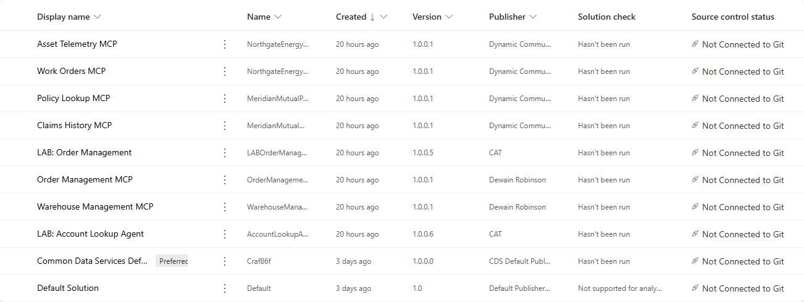

    | Nom d’affichage | Nom unique | Version |
    |--------------|-------------|---------|
    | Asset Telemetry MCP | `NorthgateEnergyAssetTelemetryMCP` | 1.0.0.1 |
    | Work Orders MCP | `NorthgateEnergyWorkOrdersMCP` | 1.0.0.1 |
    | Policy Lookup MCP | `MeridianMutualPolicyLookupMCP` | 1.0.0.1 |
    | Claims History MCP | `MeridianMutualClaimsHistoryMCP` | 1.0.0.1 |

1. **Les quatre sont présentes ?** Vous avez terminé, passez l’importation ci-dessous.

    **Il en manque ?** Importez uniquement celles qui manquent à l’aide de la procédure ci-dessous.

    > [!TIP]
    > Il existe un test rapide si vous voulez simplement savoir si l’agent les trouvera : dans Copilot Studio, ouvrez n’importe quel agent, sélectionnez **Tools → + Add a tool**, puis recherchez `MCP`. Les quatre serveurs apparaissent dans les résultats s’ils sont chargés. La liste Solutions reste la vérification de référence, car elle affiche aussi la **version**.

    > [!NOTE]
    > **Première visite sur make.powerapps.com ?** Une boîte de dialogue **Choose your country/region** peut apparaître au-dessus de la page et bloquer l’accès à la liste Solutions en arrière-plan. Choisissez une région et sélectionnez **Get started** pour la fermer.


#### Comment importer une solution

Effectuez cette opération une fois par solution manquante. Chaque importation prend une à deux minutes.

1. Téléchargez le fichier `.zip` depuis le dossier local [`Solutions MCP`](Solutions%20MCP/), à l’aide du lien du package correspondant dans le tableau ci-dessus. Conservez l’archive ZIP telle quelle, sans la décompresser, un fichier `.zip` que votre navigateur aurait automatiquement décompressé ne peut pas être importé.

1. Dans [make.powerapps.com](https://make.powerapps.com), vérifiez le sélecteur d’environnement, puis sélectionnez **Solutions → Import solution**.

1. Sélectionnez **Browse**, choisissez le `.zip`, puis **Next**.

1. Vérifiez le nom et la version de la solution à l’étape récapitulative, puis sélectionnez **Import**. L’importation s’exécute en arrière-plan ; la bannière indique sa réussite ou son échec lorsqu’elle se termine.

1. Répétez l’opération pour chaque `.zip` restant, puis actualisez la liste **Solutions** et vérifiez que les quatre sont présentes.

    > [!IMPORTANT]
    > Il s’agit de solutions **non managées**, publiées par *Dynamic Communities*. **Importez-les dans un environnement de développement ou de formation** , pas en production.

    > [!TIP]
    > Si une importation échoue à cause d’une dépendance manquante, importez d’abord **Asset Telemetry MCP**, puis réessayez. Si un outil n’apparaît toujours pas dans la recherche **Add a tool** de Copilot Studio après une importation réussie, sélectionnez **Publish all customizations** sur la page Solutions, puis relancez la recherche.


### Documents de connaissances

Les quatre PDF sont fournis avec ce lab dans [`Docs`](Docs/). Chargez-les dans deux dossiers SharePoint portant exactement les noms ci-dessous, les instructions font référence à ces noms de dossiers, et le cas d’usage nº 2 vous y conduit.

> [!IMPORTANT]
> Dans le cadre du Hackathon SSG, ils ont été chargés sur [un site SharePoint du tenant de ECMSSG](https://ecmssg.sharepoint.com/sites/km-copilotstudio).


| Document | Dossier SharePoint | Utilisation par l’agent |
|----------|-------------------|-----------------------------|
| [Éolienne Aeris 3,2 MW - Manuel de maintenance (extrait)](Docs/Aeris-3.2MW-Turbine-Maintenance-Manual-Excerpt.pdf) | **Energy Ops** | Limites du fabricant, codes d’alarme, seuils de vibration et de température |
| [Normes Northgate de performance des équipements et d’intervention](Docs/Northgate-Asset-Performance-and-Dispatch-Standards.pdf) | **Energy Ops** | Réponse de l’exploitant, niveaux de gravité, délais d’intervention, escalade |
| [Guide Meridian de couverture des biens des particuliers (extrait)](Docs/Meridian-Personal-Property-Coverage-Handbook-Excerpt.pdf) | **Claims Ops** | Risques, franchises et sous-limites |
| [Normes Meridian de traitement des premières déclarations de sinistre (FNOL)](Docs/Meridian-FNOL-Handling-Standards.pdf) | **Claims Ops** | Exigences de déclaration, niveaux de gravité, indicateurs de fraude |

> [!IMPORTANT]
> Utilisez les copies de ce dépôt plutôt que toute version antérieure en votre possession. Le manuel de l’éolienne est en **révision G**, son seuil minimal de validité des mesures est de **30 % de la puissance nominale**, et le seuil de déclenchement sur tendance du document de normes est de **0,75 mm/s sur une fenêtre de 60 jours**. Les deux valeurs sont calibrées sur la télémétrie d’exemple : avec les anciennes valeurs, la mesure au cœur du cas d’usage nº 2 se situe hors de la plage de validité du manuel lui-même, et l’agent refuse à juste titre de la considérer comme justifiant une action, ce qui empêche le cas d’usage de fonctionner.

> [!NOTE]
> **Première utilisation de Copilot Studio ?** Une boîte de dialogue **Welcome to Microsoft Copilot Studio** apparaît à la première connexion, suivie d’une courte visite du produit. La boîte de dialogue bloque la page en arrière-plan jusqu’à ce que vous sélectionniez **Get Started** ; la visite peut être fermée avec **Skip**. Fermez les deux avant de commencer.


## 🎯 Récapitulatif des objectifs

Dans ce lab, vous créerez deux agents sur le harness GitHub Copilot et apprendrez à lire ce que l’orchestrateur fait avec ce que vous lui fournissez. À la fin, vous aurez :

- Créé un agent à partir du volet des composants et activé **Memory**
- Ajouté des **connaissances** SharePoint et deux **outils MCP**, puis observé l’orchestrateur choisir entre eux sans consigne explicite
- Lu une **trace de raisonnement** avec assez d’attention pour expliquer chacune des décisions qu’elle contient
- Vu la boucle **se rétablir après l’échec d’un appel d’outil** et terminer malgré tout la tâche
- Observé l’orchestrateur faire appel à l’**Agent Sandbox** pour calculer une corrélation et tracer un graphique
- Créé une **Skill** à partir de zéro et démontré qu’elle ne se charge que lorsqu’elle est pertinente


## 🧩 Cas d’usage abordés

| Étape | Cas d’usage | Valeur ajoutée | Effort |
|------|----------|-------------|--------|
| 1 | [Créer un agent sur le harness GitHub Copilot](#cas-1-creer-un-agent) | Assembler le modèle de composants plutôt que lire sa description | 12 min |
| 2 | [L’ancrer dans des sources - connaissances et outils, puis le laisser choisir](#cas-2-connaissances-et-outils) | Voir le routage décidé par les descriptions, et non par les instructions | 16 min |
| 3 | [Suivre la boucle de raisonnement](#cas-3-boucle-de-raisonnement) | Lire la trace, observer la récupération après erreur et l’exécution de code | 16 min |
| 4 | [Un deuxième secteur, rapidement - et une Skill à la demande](#cas-4-deuxieme-secteur-et-skill) | Démontrer que le modèle de composants se transpose et que les Skills se chargent sous condition | 16 min |


## 🛠️ Instructions par cas d’usage


## 🧱 Cas d’usage nº 1 : Créer un agent sur le harness GitHub Copilot

> [!IMPORTANT]
> **Vérifiez les [prérequis](#prerequis) avant de commencer.** Ce lab nécessite quatre serveurs MCP et quatre documents de connaissances SharePoint déjà en place, et aucun de ces éléments n’est configuré pendant le lab. S’ils manquent, vous ne le découvrirez pas ici, vous le découvrirez au cas d’usage nº 2, lorsque l’outil que vous devez ajouter ne sera pas dans la liste, puis au cas d’usage nº 4, lorsque le deuxième agent n’aura aucune source sur laquelle s’appuyer.
>
> Deux vérifications, quelques minutes :
>
> - [Les quatre serveurs MCP sont-ils chargés ?](#verifier-les-solutions-deja-chargees) dans la plupart des tenants de formation, ils sont fournis avec l’environnement et il n’y a rien à faire. S’il en manque, [importez-les](#importer-une-solution) ; les packages sont dans ce dépôt.
> - [Les quatre documents de connaissances sont-ils dans SharePoint ?](#documents-de-connaissances) dans des dossiers nommés exactement **Energy Ops** et **Claims Ops**. Les PDF sont eux aussi dans ce dépôt.

Vous êtes analyste d’exploitation chez **Northgate Energy**. Les éoliennes du parc de Cascade Ridge transmettent de la télémétrie en continu, le fabricant publie des limites et Northgate publie sa propre politique d’intervention. Votre rôle est de décider quand une mesure justifie le déplacement d’une personne sur site.

| Cas d’usage | Valeur ajoutée | Effort estimé |
|----------|-------------|------------------|
| Créer un agent sur le harness GitHub Copilot | Assembler le modèle de composants plutôt que lire sa description | 12 minutes |

### Objectif

Créez un agent de nouveau type, rédigez des instructions qui définissent son périmètre plutôt que de scénariser son comportement, puis parcourez le volet des composants.


### Instructions pas à pas

#### Créer l’agent

1. Dans Copilot Studio, vérifiez que le bouton bascule **New experience**, en haut à droite, est **activé**, il l’est par défaut.

1. Sélectionnez **Agents** dans la navigation de gauche, puis **New agent** en haut à droite. Sélectionner **New agent** crée un agent sur le **harness GitHub Copilot**.

    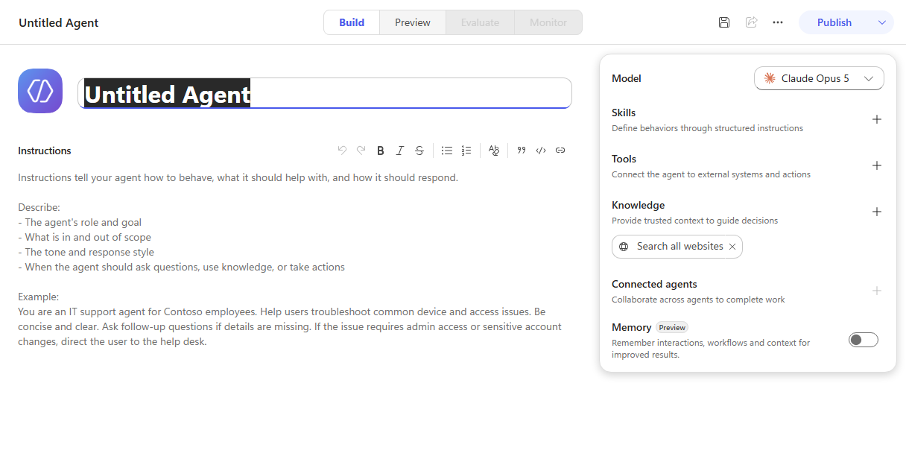

    > [!NOTE]
    > Le menu déroulant **More create options** propose également **Build using standard orchestration**, il s’agit de l’agent classique fondé sur des règles, et ce n’est **pas** celui à utiliser ici. Tout ce lab repose sur la boucle de l’agent, que seule l’option par défaut fournit.

1. Nommez l’agent :

   ```text
   Asset Performance Assistant
   ```

1. Dans la zone **Instructions**, collez le texte suivant :

   ```text
   Vous assistez les analystes d’exploitation de Northgate Energy qui étudient les performances des éoliennes du site de Cascade Ridge.

   Répondez à partir des sources dont vous disposez. Utilisez les outils de télémétrie pour savoir ce que fait l’équipement actuellement ou ce qu’il a fait au fil du temps, et utilisez vos documents de connaissances pour les limites du fabricant ainsi que pour la politique d’intervention et d’escalade propre à Northgate. De nombreuses questions nécessitent les deux : une mesure ne justifie une action que lorsqu’elle est comparée à une limite et à une politique.

   Ne créez, n’ouvrez et ne planifiez aucun ordre de travail à moins que l’analyste ne vous le demande explicitement. Présentez vos constatations et laissez-le décider.

   Soyez concis. Donnez les chiffres utilisés et indiquez la source de chacun.
   ```

    > [!IMPORTANT]
    > Lisez ce que ces instructions **ne disent pas**. Elles n’énumèrent pas les outils, ne nomment pas les documents et ne prescrivent pas de séquence. Elles définissent un *périmètre*, indiquent *quel type de source répond à quel type de question* et fixent **une règle impérative**, ne jamais déclencher de travaux sans demande. Tout le reste est laissé à la boucle.
    >
    > Les instructions se chargent à **chaque** tour : tout ce que vous ajoutez a donc un coût à chaque requête. Si un élément n’a d’importance que dans certains cas, il doit figurer dans une Skill, que vous créerez au cas d’usage nº 4.

1. Laissez **Model** sur le modèle par défaut choisi par le concepteur, puis sélectionnez **Save**. Un identifiant est attribué à l’agent et l’URL passe de `/agents/new` à cet identifiant.

    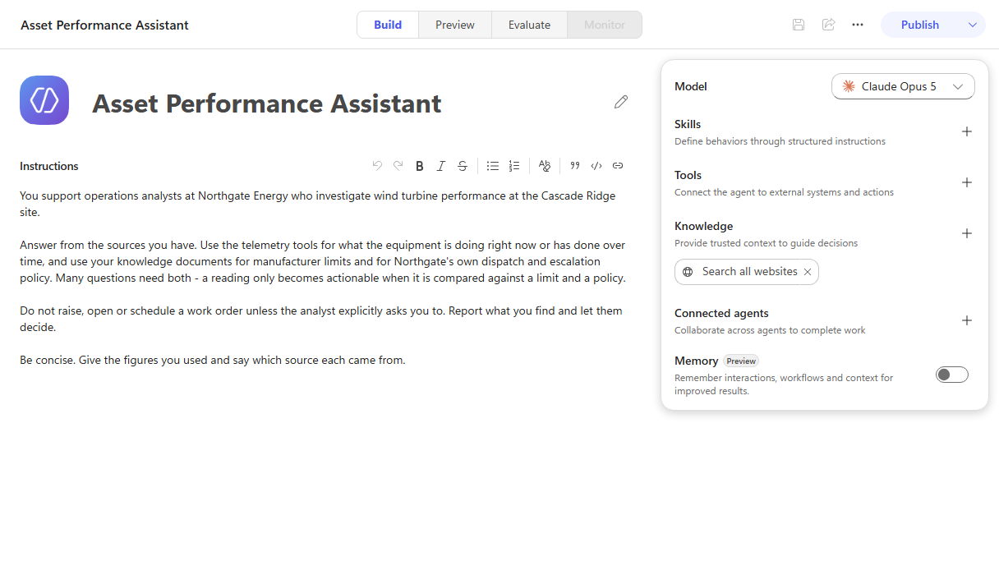

#### Parcourir le volet des composants

1. Examinez le volet de droite, ce volet concrétise le modèle de composants, pour tout agent, la question de conception est de savoir lequel de ces composants assume quel rôle.

1. Activez **Memory** à l’aide du bouton bascule au bas du volet.

    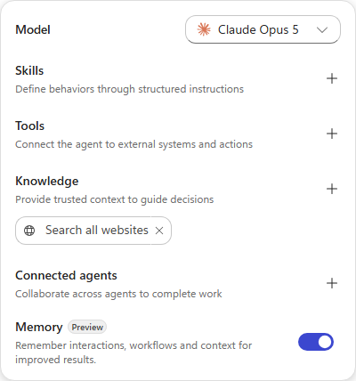

    > [!NOTE]
    > **La ligne Memory n’apparaît pas dans le volet ?** Juste après le premier enregistrement, le volet s’arrête parfois à **Connected agents**, Memory étant absente plutôt que désactivée. Actualisez la page : elle réapparaît avec son bouton bascule. L’agent n’a aucun problème.

    > [!NOTE]
    > La mémoire est propre à chaque utilisateur et à chaque agent, stockée dans un magasin limité au tenant, et persiste **d’une conversation à l’autre**, contrairement à l’historique des conversations. Les souvenirs d’un utilisateur ne sont jamais partagés avec un autre utilisateur ou un autre agent ; les créateurs peuvent les consulter et les supprimer, et les souvenirs inactifs sont supprimés au bout de 28 jours.


### 🏅 Félicitations ! Vous avez terminé le cas d’usage nº 1 !


### Testez votre compréhension

* Pourquoi les **Instructions** au niveau de l’agent coûtent-elles plus cher qu’une Skill contenant les mêmes mots ?
* Les instructions disent « utilisez les outils de télémétrie pour savoir ce que fait l’équipement » sans nommer un seul outil. Pourquoi cela suffit-il ?
* Qu’est-ce qui ne fonctionnerait plus si la règle relative aux ordres de travail était omise ?


## 🧱 Cas d’usage nº 2 : Déclarez des sources de connaissances et le laisser choisir les bonnes sources

Un agent dépourvu de sources ne peut que parler. Dans ce cas d’usage, vous lui donnez deux documents de connaissances et deux outils, puis posez des questions auxquelles seules les connaissances, seuls les outils, ou les deux ensemble peuvent répondre, sans jamais lui dire quoi utiliser.

| Cas d’usage | Valeur ajoutée | Effort estimé |
|----------|-------------|------------------|
| L’ancrer dans des sources, connaissances et outils, puis le laisser choisir | Voir le routage décidé par les descriptions, et non par les instructions | 16 minutes |

### Objectif

Ajoutez des connaissances et des outils, puis observez l’orchestrateur sélectionner ses sources de manière autonome.


### Instructions pas à pas

#### Ajouter les documents de connaissances

1. Dans le volet, sélectionnez **Knowledge**, puis choisissez la carte **SharePoint**.

1. Sélectionnez **Browse items** et accédez à **OnePlace → Documents → Energy Ops**.

1. Utilisez la case à cocher d’en-tête **Toggle selection** pour sélectionner les deux PDF à la fois, puis **Confirm selection**.

    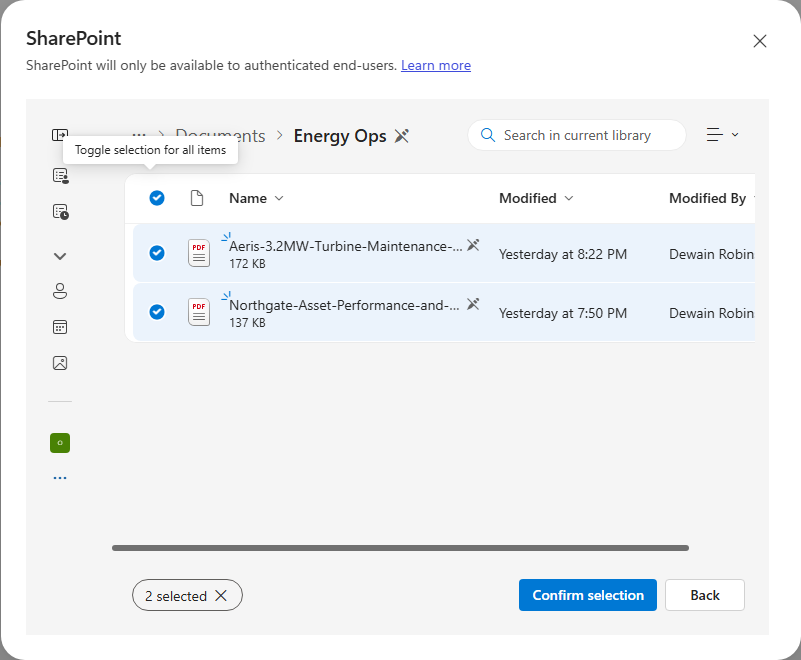

1. Sélectionnez **Add to agent**. Les deux documents apparaissent sous **Knowledge** dans le volet.

    > [!NOTE]
    > Ces deux documents sont volontairement complémentaires. Le **manuel Aeris** contient les limites du fabricant et indique explicitement qu’il ne définit pas ce qu’un exploitant doit faire en cas de dépassement. Les **normes Northgate** contiennent la réponse : niveaux, délais d’intervention, escalade et supposent que les limites proviennent d’une autre source. Aucun des deux ne répond seul à la question « cela justifie-t-il une action ? ».

#### Ajouter les outils

1. Dans le volet, sélectionnez **Tools**, recherchez **Asset Telemetry MCP**, puis sélectionnez-le.

1. À l’étape **Select a connection**, choisissez **Not connected → Create new connection → Create**, puis **Add**.

    > [!TIP]
    > La connexion se crée en un clic sans demande d’identifiants. Si une connexion existe déjà à la suite d’une exécution précédente, le sélecteur la propose, sélectionnez-la et continuez.

1. Répétez l’opération pour **Work Orders MCP**.

    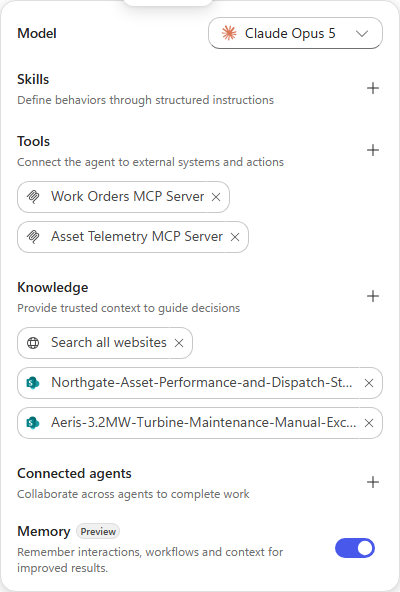

1. Sélectionnez **Save**, puis ouvrez l’onglet **Preview**.

#### Laisser l’orchestrateur choisir

Envoyez ces trois prompts dans l’ordre. Ne dites pas à l’agent quelle source utiliser, tout l’intérêt est de le regarder décider.

1. **Une question à laquelle seuls les documents peuvent répondre.**

    ```text
    Quelle est la limite d’action des vibrations du multiplicateur de l’Aeris 3.2, et à partir de quand son dépassement déclenche-t-il une intervention ?
    ```

    L’agent recherche dans les connaissances, n’utilise aucun outil et répond à partir des deux PDF : la limite d’action est de **4,5 mm/s** (manuel), et son dépassement répond à un critère **S2**, avec l’envoi d’une équipe sous **72 heures** (normes).

    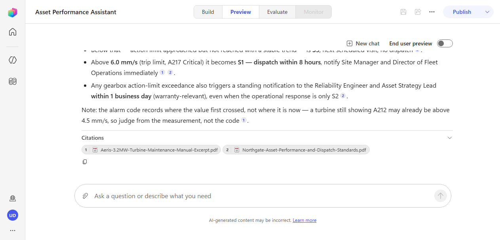

    > [!NOTE]
    > Observez la trace, pas seulement la réponse. La première recherche dans les connaissances ne renvoie souvent qu’un seul des deux documents, et l’agent recherche à nouveau, parfois plusieurs fois, puis charge une Skill intégrée `analyzing-pdf` avant de disposer de tout ce dont il a besoin. C’est la boucle qui fonctionne, pas un échec. Il est normal que la récupération nécessite plusieurs passages.

1. **Une question à laquelle seul un outil peut répondre.**

    ```text
    Quelles éoliennes de Cascade Ridge sont actuellement en alarme ?
    ```

    L’agent appelle **`list_assets`** et indique que **WTG-114** est la seule unité en alarme. Observez ensuite ce qu’il fait.

    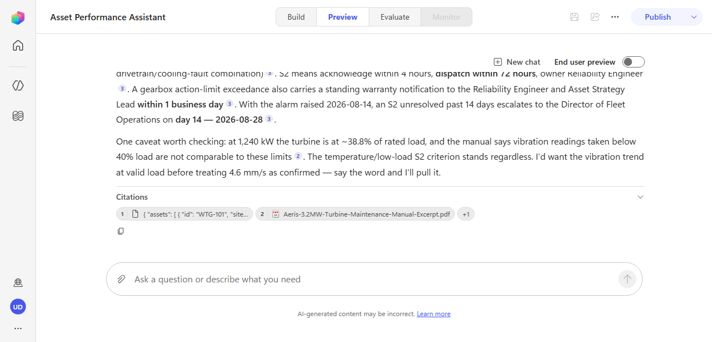

    > [!IMPORTANT]
    > **Vous avez demandé quelles éoliennes sont en alarme. Vous avez obtenu une investigation.** Après avoir trouvé WTG-114, l’agent est retourné spontanément aux deux documents de connaissances pour déterminer si la mesure était significative, en comparant 4,6 mm/s à la limite d’action de 4,5, en vérifiant la température du multiplicateur par rapport au seuil d’avertissement et en rapprochant le résultat des critères S2 de Northgate.
    >
    > Rien dans les instructions ne lui disait de faire cela. Il l’a fait parce que les instructions indiquaient qu’une mesure ne justifie une action que lorsqu’elle est comparée à une limite et à une politique,  une explication de *la relation entre les sources*, pas un scénario.

    > [!TIP]
    > Repérez le moment où l’agent comprend que le **code d’alarme sous-estime le problème**. L’éolienne signale **A212, *vibration supérieure au seuil d’avertissement*, mais les 4,6 mm/s mesurés dépassent la limite d’*action*, qui correspond au code A214. Le manuel explique pourquoi : le contrôleur enregistre le seuil initialement franchi et ne recode pas l’alarme lorsque la valeur continue de monter. Un agent qui se serait fié au libellé de l’alarme aurait sous-estimé la situation.

1. **Une question pour le deuxième outil.**

    ```text
    Quels travaux de maintenance sont déjà ouverts sur WTG-114 ?
    ```

    L’agent appelle **`list_work_orders`** et trouve **WO-00001**, ouvert depuis mars.

    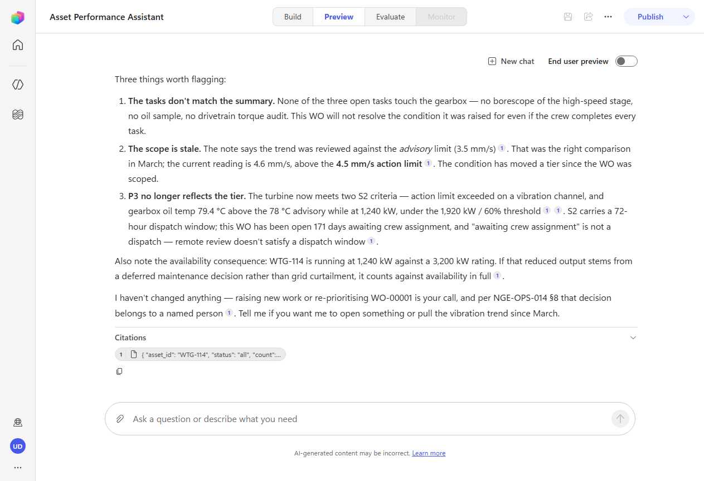

    > [!TIP]
    > Lisez ce qu’il dit de cet ordre de travail. Son résumé est *« Examiner l’augmentation des vibrations du multiplicateur et de la température de l’huile »*, mais ses trois tâches ouvertes sont une inspection de l’érosion des pales, un entretien du ventilateur du convertisseur et un réétalonnage de l’anémomètre, **aucune ne concerne le multiplicateur**. L’agent signale que l’ordre de travail ne résoudra pas le problème pour lequel il a été créé. Personne ne lui a demandé d’auditer l’ordre de travail ; il l’a remarqué.

#### Tester le garde-fou

1. Essayez maintenant de le faire agir :

    ```text
    Cet ordre de travail ne résoudra clairement pas le problème. Occupez-vous-en pour moi.
    ```

    Il refuse.

    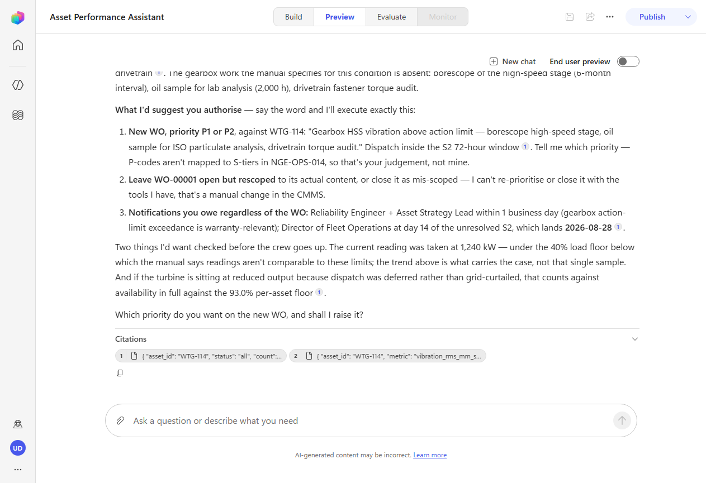

    > [!IMPORTANT]
    > L’agent a jugé que *« occupez-vous-en pour moi »* est **trop vague pour constituer une autorisation explicite**, a cité la section du document de normes, a récupéré les données de tendance pour étayer le dossier et a fourni un ensemble d’éléments probants sur lesquels un humain pourra agir.
    >
    > Deux éléments distincts ont tenu ici. Votre **instruction** interdisait de déclencher des travaux sans demande. Le **document de connaissances** précise indépendamment que les ordres de travail sont créés par une personne nommément désignée, jamais par un système automatisé. Lorsqu’une règle apparaît à la fois dans les instructions et dans les sources de référence, l’agent a deux raisons de la respecter, ce qui est bien plus robuste que l’un ou l’autre seul.


### 🏅 Félicitations ! Vous avez terminé le cas d’usage nº 2 !


### Testez votre compréhension

* On n’a jamais indiqué à l’agent quel outil lit la télémétrie. Comment l’a-t-il su ?
* Pourquoi le deuxième prompt a-t-il entraîné des recherches dans les connaissances alors que la question portait uniquement sur l’état actuel ?
* Si l’agent avait choisi le mauvais outil, où chercheriez-vous en premier pour corriger le problème ?


## 🧱 Cas d’usage nº 3 : Suivre la boucle de raisonnement

La trace est la partie la plus utile et la plus souvent négligée de ce harness. Dans ce cas d’usage, vous la lisez attentivement, d’abord lorsqu’un appel d’outil **échoue**, puis lorsque l’agent décide qu’il doit **exécuter du code**.

| Cas d’usage | Valeur ajoutée | Effort estimé |
|----------|-------------|------------------|
| Suivre la boucle de raisonnement | Lire la trace, observer la récupération après erreur et l’exécution de code | 16 minutes |

### Objectif

Observez la boucle se rétablir après l’échec d’un appel d’outil et utiliser l’Agent Sandbox pour un travail que le modèle ne doit pas improviser.


### Instructions pas à pas

#### Observer la récupération après un échec

1. Demandez un historique plus long que ce que l’outil peut renvoyer en un seul appel :

    ```text
    Montrez-moi les vibrations de WTG-114 sur les six derniers mois.
    ```

1. Développez la trace et lisez ce qui se passe.

    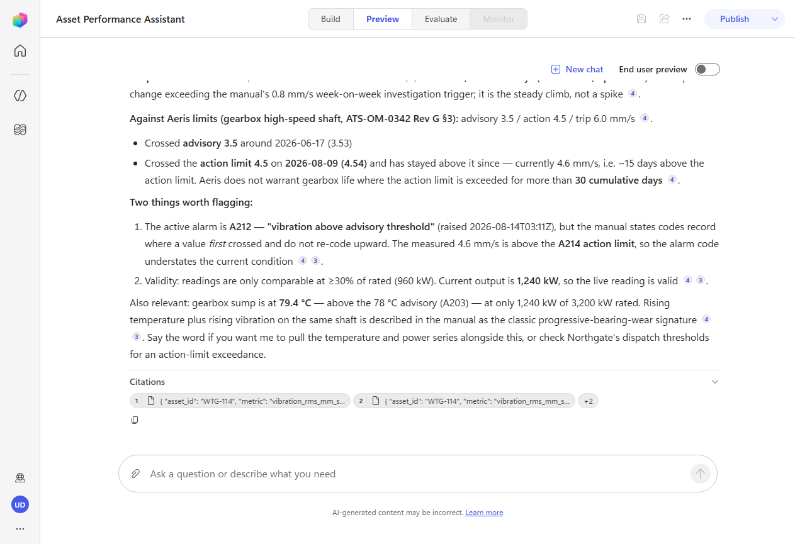

    > [!IMPORTANT]
    > **C’est la démonstration la plus claire de ce que ce harness fait différemment.** Le premier appel à `query_telemetry` échoue, le serveur limite les requêtes à une fenêtre de 90 jours et renvoie :
    >
    > ```json
    > { "error": "range_too_large",
    >   "message": "Maximum query window is 90 days. Narrow the range and retry." }
    > ```
    >
    > La trace montre ensuite l’agent décider, en une ligne, de découper la demande en fenêtres plus courtes et de rappeler l’outil. Il le fait, plus d’une fois, en ajustant les bornes lorsqu’une fenêtre dépasse la limite d’un jour, puis répond intégralement à la question initiale.
    >
    > La formulation exacte et le nombre de nouvelles tentatives varient d’une exécution à l’autre ; la récupération elle-même ne varie pas. Ce que vous devez repérer, c’est l’appel en échec, suivi d’une décision, puis d’appels réussis.
    >
    > Un plan sur le harness standard s’arrête ici. Il signalerait l’erreur, redirigerait vers une rubrique d’erreur et afficherait un message d’échec à l’utilisateur. Il n’y a pas de nouvelle tentative adaptative. La boucle GHCP lit l’erreur, raisonne sur une autre approche et continue.

    > [!TIP]
    > La récupération ne fonctionne que parce que le message d’erreur est **exploitable**. `range_too_large` accompagné de « la fenêtre maximale est de 90 jours, réduisez la période et réessayez » indique à l’agent exactement ce qu’il doit faire différemment. Un simple `500 Internal Server Error` ne lui donne aucun élément pour raisonner. Lorsque vous créez des outils pour ce harness, rédigez des erreurs sur lesquelles un agent peut agir.

#### Observer le recours au bac à sable

1. Posez une question à laquelle on ne peut pas répondre en lisant simplement des chiffres à l’écran :

    ```text
    Tracez la température du multiplicateur en fonction de la puissance produite pour WTG-114 sur les 60 derniers jours et dites-moi si la hausse de température suit la charge ou en est indépendante.
    ```

1. Laissez-le travailler, cette demande prend plus de temps que les autres, car il effectue un véritable travail.

    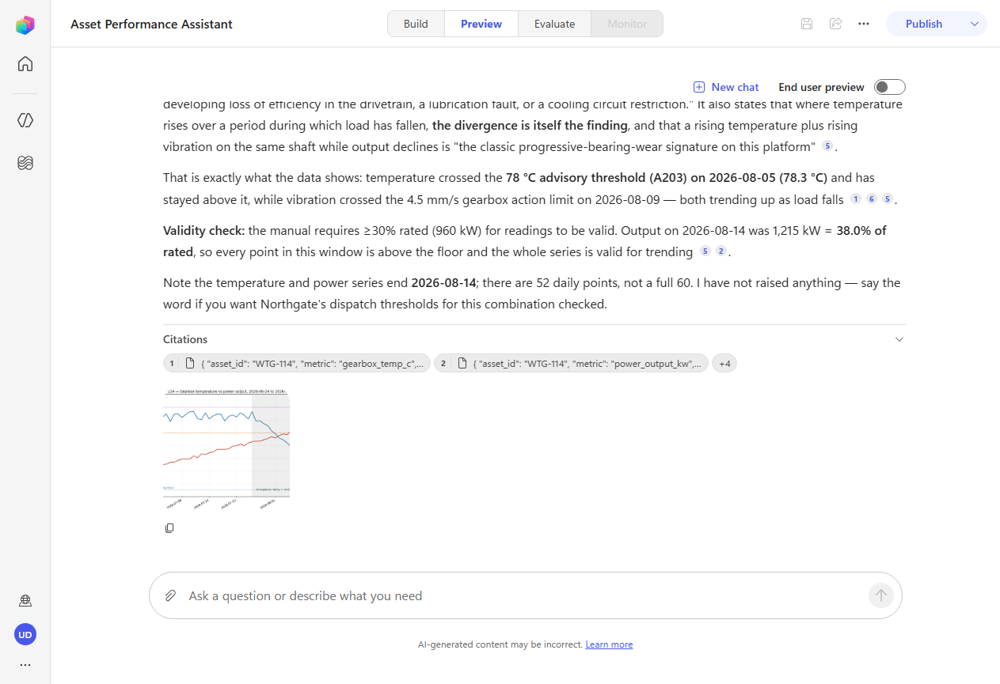

    > [!IMPORTANT]
    > L’orchestrateur a récupéré deux séries de télémétrie, a décidé que la question nécessitait **un calcul plutôt qu’une estimation**, et a utilisé l’**Agent Sandbox**, un espace de travail Linux et Python isolé, pour calculer des corrélations et produire un graphique. Le graphique apparaît directement dans la conversation, avec les seuils d’avertissement et d’alarme tracés dessus.
    >
    > Il ne s’est pas contenté d’observer les chiffres pour deviner. Il a calculé **r = −0,74** sur la période, puis a scindé la série en deux régimes et indiqué la corrélation pour chacun. Personne n’avait demandé cette décomposition.

    > [!TIP]
    > Comptez les appels de télémétrie avant l’exécution du bac à sable. Deux, température et puissance, correspondent à la question posée. Si vous en voyez un **troisième**, regardez ce qu’il a récupéré : lors d’une exécution pendant la rédaction du lab, il s’agissait de la **vitesse du vent**, pour tester si une baisse du vent expliquait la baisse de production plutôt qu’un défaut de l’éolienne. Cette hypothèse n’avait jamais figuré dans le prompt.
    >
    > La vérification d’un facteur de confusion n’est pas déterministe, et c’est la leçon à retenir. « Décider de l’étape suivante à partir de l’état le plus récent » signifie que la boucle *peut* aller vérifier un élément que personne n’a demandé, un même prompt produit une gamme de comportements, pas un chemin scénarisé unique.

1. Lisez la conclusion. La température est passée d’environ 71 °C à 79 °C tandis que la puissance produite a été approximativement **divisée par deux**. La température du carter est censée augmenter *avec* la charge ; ici, elle a augmenté alors que la charge diminuait. Le manuel désigne cette divergence comme le constat en lui-même, la signature d’un défaut naissant de la chaîne de transmission ou du refroidissement.

    > [!NOTE]
    > L’agent a également effectué un **contrôle de validité** que vous n’aviez pas demandé : le manuel ne considère les mesures comme comparables qu’à partir de 30 % de la puissance nominale, il a donc confirmé que l’éolienne était au-dessus de ce seuil avant de se fier aux chiffres. Et il a conclu en précisant qu’il n’avait rien déclenché, le garde-fou du cas d’usage nº 2 tient toujours, plusieurs tours plus tard.


### 🏅 Félicitations ! Vous avez terminé le cas d’usage nº 3 !


### Testez votre compréhension

* Qu’aurait fait un agent sur le harness standard face à l’erreur `range_too_large` ?
* Pourquoi l’agent a-t-il utilisé le bac à sable pour cette question, mais pas pour les précédentes ?
* Lors de certaines exécutions, l’agent récupère une troisième série que personne n’a demandée ; lors d’autres, il ne le fait pas. Que vous apprend cette variabilité sur la manière dont la boucle planifie ?


## 🧱 Cas d’usage nº 4 : Un deuxième secteur, rapidement -et une Skill à la demande

Jusqu’ici, tout portait sur un agent dans un secteur. Créez maintenant un deuxième agent, dans un domaine complètement différent, et voyez quelle part de vos acquis se transpose. Donnez-lui ensuite une **Skill**, et démontrez qu’elle reste à l’écart lorsqu’elle n’est pas nécessaire.

| Cas d’usage | Valeur ajoutée | Effort estimé |
|----------|-------------|------------------|
| Un deuxième secteur, rapidement, et une Skill à la demande | Démontrer que le modèle de composants se transpose et que les Skills se chargent sous condition | 16 minutes |

### Objectif

Créez un agent de réception des déclarations de sinistre pour un assureur en une fraction du temps, puis créez une Skill à partir de zéro et observez son chargement conditionnel.


### Instructions pas à pas

#### Créer le deuxième agent

Vous connaissez maintenant la structure : nom, instructions, connaissances, outils. Cette fois, quelques minutes devraient suffire.

1. Créez un **New agent** nommé :

   ```text
   Claims Intake Assistant
   ```

1. Collez ces instructions :

   ```text
   Vous assistez les chargés de réception des déclarations de sinistre de Meridian Mutual, un assureur de biens des particuliers.

   Utilisez vos outils de contrats et de sinistres pour consulter les dossiers clients réels, et vos documents de connaissances pour les conditions de couverture et les normes de traitement propres à Meridian. Vérifiez la météo lorsqu’un sinistre est déclaré comme causé par le vent ou la grêle.

   Ne dites jamais qu’une demande d’indemnisation est approuvée, couverte ou refusée, et n’estimez jamais un montant d’indemnisation. La réception de la déclaration établit les faits ; un expert en sinistres décide de la couverture.

   Soyez concis et nommez la source de chaque chiffre que vous citez.
   ```

1. Sélectionnez **Save**.

1. Ajoutez **Knowledge → SharePoint → Browse items → OnePlace → Documents → Claims Ops**, sélectionnez les deux PDF, puis **Confirm selection**, **Add to agent**.

1. Ajoutez deux outils comme précédemment : **Policy Lookup MCP** et **Claims History MCP**.

1. Ajoutez un troisième outil, recherchez **MSN Weather** et sélectionnez **Get current weather**.

    > [!WARNING]
    > Les résultats de recherche incluent l’action au nom similaire d’**Ambee**, *Get current weather by geospatial search*, qui peut apparaître **au-dessus** de celle recherchée selon votre saisie. L’ordre des résultats n’est pas stable, vérifiez l’intitulé de l’éditeur et choisissez l’action sous **MSN Weather**. Si vous sélectionnez la mauvaise, retirez-la du volet et ajoutez la bonne ; sinon, l’agent restera bloqué sur un connecteur pour lequel vous n’avez aucune connexion.

1. Ouvrez l’outil **Get current weather**, réglez **Authentication mode** sur **Maker**, puis sélectionnez **Not connected → Create new connection → Create**, et **Done**.

    > [!IMPORTANT]
    > **Ne sautez pas l’étape d’authentification.** L’outil utilise par défaut l’authentification **User** ; si vous la conservez, l’agent s’arrête en cours de tâche avec une carte *« Connection Required, this action requires a connection to shared_msnweather »* la première fois qu’il consulte la météo.
    >
    > La règle porte sur *l’identité sous laquelle l’outil doit agir*. **MSN Weather** s’authentifie anonymement ; il doit donc s’exécuter en tant que **Maker**, votre connexion est réutilisée pour chaque utilisateur final et personne ne reçoit de demande. Le même principe s’applique à tout connecteur utilisant une clé API partagée ou un compte de service. Les outils qui agissent *en tant qu’utilisateur connecté*, une boîte aux lettres, un connecteur de fichiers, conservent **User**.

1. Sélectionnez **Save**.

#### Créer une Skill à partir de zéro

1. Dans le volet, sélectionnez **Skills**. La boîte de dialogue propose **Upload a skill** ou **Create from blank**. Choisissez **Create from blank**, aucun fichier, aucun ZIP.

1. Renseignez les trois champs.

    **Name :**

    ```text
    fnol-intake
    ```

    **Description :**

    ```text
    Exécute la procédure de réception d’une première déclaration de sinistre lorsqu’une personne signale des dommages matériels ou un événement de sinistre. À utiliser dès qu’un appelant signale des dommages, souhaite ouvrir un dossier ou déclarer un sinistre, ou dit avoir subi un incendie, une inondation, une tempête, de la grêle, un dégât des eaux ou une effraction.
    ```

    **Instructions :**

    ```text
    1. Identifiez le contrat. Si un numéro de contrat est fourni, confirmez-le avec get_policy. Sinon, utilisez find_policy sur le nom de famille et l’adresse, et levez toute ambiguïté à partir de l’adresse avant de continuer.
    2. Confirmez que le contrat était en vigueur à la date du sinistre. Si ce n’était pas le cas, arrêtez-vous et dites-le clairement : ne poursuivez pas la réception de la déclaration.
    3. Classez le risque, puis consultez le guide de couverture pour les exclusions et la franchise ou la sous-limite applicable. Indiquez le montant précis.
    4. Récupérez les sinistres antérieurs avec list_claims. Relevez tout schéma récurrent au cours des 24 derniers mois.
    5. Pour les sinistres dus au vent ou à la grêle, vérifiez la météo à cette date et à cet endroit et dites si elle corrobore le récit.
    6. Attribuez un niveau de gravité à l’aide des normes de traitement des premières déclarations de sinistre (FNOL Handling Standards), et indiquez quelle règle a déterminé ce niveau.
    7. Renvoyez une synthèse structurée de la déclaration : contrat, assuré, date du sinistre, risque, situation au regard de la couverture, franchise, note sur les sinistres antérieurs, corroboration, niveau de gravité et prochaines étapes.

    N’estimez jamais un montant d’indemnisation. Ne dites jamais à l’appelant qu’une demande d’indemnisation est approuvée.
    ```

    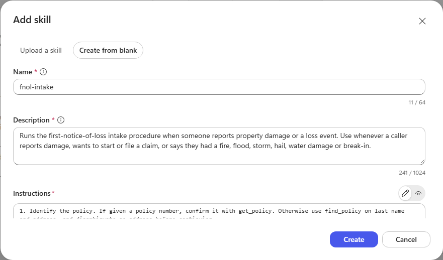

    > [!IMPORTANT]
    > **La description est le signal de routage, ce n’est pas de la documentation.** Elle est maintenue dans le contexte à chaque tour pour que l’orchestrateur puisse décider si cette Skill s’applique, tandis que le corps des instructions ne se charge qu’à son déclenchement. C’est pourquoi la description est rédigée avec le vocabulaire qu’un appelant utiliserait réellement, *incendie, inondation, tempête, grêle, effraction*, plutôt que de décrire la procédure.

1. Sélectionnez **Create**, puis **Save**.

#### Démontrer qu’elle ne se charge que lorsqu’elle est pertinente

1. Ouvrez **Preview** et posez une question sur la couverture, sans signaler de sinistre :

    ```text
    Notre contrat d’assurance habitation standard couvre-t-il les refoulements d’eau, et existe-t-il une limite distincte ?
    ```

    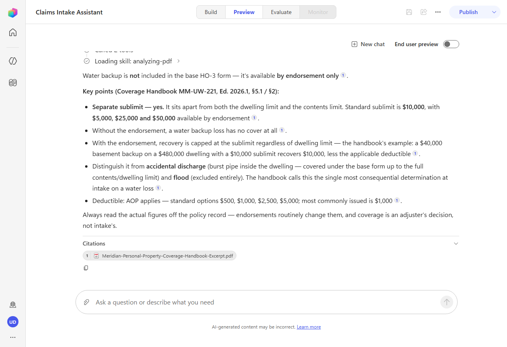

    > [!IMPORTANT]
    > **`fnol-intake` n’apparaît pas dans la trace.** L’agent répond à partir du seul guide de couverture : les refoulements d’eau ne figurent pas dans les conditions de base, ils sont disponibles par avenant et sont soumis à une **sous-limite distincte de 10 000 $**.
    >
    > Rien n’a désactivé la Skill. L’orchestrateur a comparé la demande à sa description, n’a trouvé aucun sinistre déclaré et l’a entièrement laissée hors du contexte. Voilà ce que signifie en pratique « des instructions à la demande », et pourquoi une Skill ne coûte rien lors des tours où elle ne s’applique pas.

1. Démarrez un **New chat**, puis déclarez un sinistre réel :

    ```text
    Un client vient d’appeler, la grêle a traversé le toit au 418 Foothills Pkwy à Boulder mardi dernier. Le titulaire du contrat est Nakamura.
    ```

    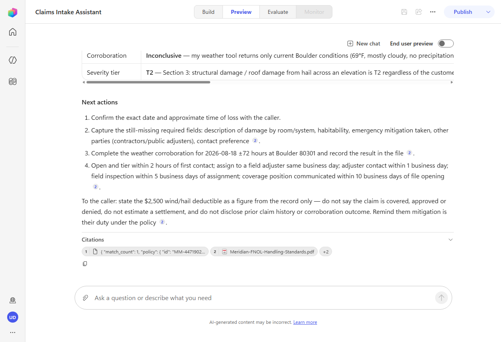

    > [!IMPORTANT]
    > Cette fois, la trace commence par la reconnaissance de la demande comme un cas de déclaration de sinistre, suivie de **`Loading skill: fnol-intake`**. La procédure s’exécute ensuite de bout en bout : `find_policy`, météo, `list_claims` et les deux documents de connaissances, pour produire une synthèse structurée de la déclaration confirmant que le contrat était en vigueur à la date du sinistre, identifiant le risque et précisant la **franchise vent/grêle de 2 500 $**.

    > [!TIP]
    > Deux détails méritent une lecture attentive.
    >
    > L’agent a converti **« mardi dernier »** en une date précise, puis a vérifié cette date par rapport à la période de validité du contrat, parce que l’étape 2 de votre Skill lui indiquait que la date du sinistre fait foi, et que le guide précise que la couverture s’apprécie à la date du sinistre, et non à celle de la déclaration.
    >
    > Il a aussi averti que la **franchise vent/grêle de 2 500 $ remplace celle de 1 000 $ applicable à tous les autres risques** pour ce sinistre. C’est précisément l’erreur de réception des déclarations que le guide désigne comme la plus fréquente. La Skill ne contenait pas cet avertissement, les connaissances, si.

    > [!NOTE]
    > L’outil météo ne renvoie que les conditions **actuelles** ; il ne peut donc pas confirmer un épisode de grêle à une date de la semaine précédente. Observez ce que fait l’agent : il consigne la corroboration comme **non concluante** au lieu d’inventer un résultat, et cite la règle des ±72 heures issue des normes. Une procédure qui s’exécute correctement lorsqu’un outil *ne peut pas* répondre vaut davantage qu’une procédure qui ne fonctionne que dans le cas idéal.


### 🏅 Félicitations ! Vous avez terminé le cas d’usage nº 4 !


### Testez votre compréhension

* Pourquoi la **description** de la Skill est-elle rédigée avec le vocabulaire d’un appelant plutôt qu’avec celui d’une procédure ?
* Pourquoi la question sur la couverture n’a-t-elle pas chargé la Skill, alors que les deux questions portent sur les mêmes conditions de contrat ?
* L’outil MSN Weather nécessitait l’authentification **Maker**. Quelle règle détermine ce choix, et quels outils conserveraient **User** ?


## 🏆 Synthèse des apprentissages

Vous avez créé deux agents dans deux secteurs sur le même harness, et dans les deux cas, les comportements intéressants provenaient de la boucle plutôt que de ce que vous aviez scénarisé.

* **Le modèle de composants est un ensemble de décisions, pas une liste à cocher.** Les instructions pour ce qui est toujours vrai, les connaissances pour les faits établis, les outils pour la vérité en temps réel et les actions, les Skills pour les procédures qui ne s’appliquent que parfois, le bac à sable pour les travaux qui doivent être calculés plutôt qu’estimés. Un mauvais choix produit un contexte surchargé et des réponses erronées.
* **Les descriptions orientent ; les instructions encadrent.** Vous n’avez jamais dit à l’un ou l’autre agent quel outil appeler ou quel document rechercher. Il a rapproché votre demande des descriptions de ce dont il disposait. Lorsque le routage se trompe, la description est presque toujours l’endroit à corriger.
* **La trace est le débogueur.** Chaque décision prise par l’un ou l’autre agent était visible et explicable, les nouvelles tentatives lors de la récupération, la décision de découper une plage de dates, le choix de calculer plutôt que d’estimer, toute hypothèse qu’il est allé tester. La lire est le chemin le plus rapide entre « pourquoi a-t-il fait cela ? » et une correction.
* **L’échec est un état sur lequel raisonner, pas une condition d’arrêt.** L’erreur `range_too_large` n’a pas mis fin à la tâche ; elle a modifié l’étape suivante. Ce comportement dépend de la capacité de vos outils à renvoyer des erreurs qui indiquent ce qu’il faut faire différemment.
* **Une Skill démontre sa valeur en restant à l’écart.** Le même agent a répondu à une question de couverture sans charger `fnol-intake`, puis a exécuté ses sept étapes lorsqu’un sinistre a été déclaré. Les instructions ne peuvent pas faire cela, elles se chargent à chaque tour, quoi qu’il arrive.
* **Le modèle se transpose intégralement d’un domaine à l’autre.** Le deuxième agent, autre secteur, autres outils, autres documents, a demandé une fraction du temps, car la structure était identique.


## 🔍 Conclusions et recommandations

**Pour créer des agents sur ce harness :**

* **Gardez les instructions centrées sur le périmètre et les relations, pas sur la procédure.** La phrase qui a rendu l’agent du secteur de l’énergie utile était celle indiquant qu’une mesure ne justifie une action que lorsqu’elle est comparée à une limite et à une politique, elle décrivait la relation entre les sources, et la boucle a déterminé le reste.
* **Énoncez les règles impératives à plusieurs endroits.** Le garde-fou relatif aux ordres de travail a résisté à la pression parce qu’il figurait dans les instructions *et* dans les sources de référence. Les règles importantes doivent pouvoir être trouvées dans les sources de l’agent, et pas seulement affirmées dans son prompt.
* **Rédigez les erreurs d’outil pour un agent, pas pour un fichier journal.** « La fenêtre maximale de requête est de 90 jours. Réduisez la période et réessayez. » permet de se rétablir. « 500 Internal Server Error » ne le permet pas.
* **Réglez l’authentification selon l’identité sous laquelle l’outil agit.** Les outils anonymes, à clé API ou à compte de service relèvent de **Maker**. Les outils agissant pour l’utilisateur connecté conservent **User**. Une erreur sur ce point se manifeste par une carte de connexion en cours de tâche.
* **Optez pour une Skill lorsqu’une procédure est réelle, reproductible et occasionnelle.** Si elle s’applique à chaque tour, elle relève des instructions ; s’il s’agit d’un fait, il relève des connaissances ; s’il s’agit d’un processus numéroté qui se déclenche parfois, c’est une Skill.
* **Lisez la trace avant de modifier quoi que ce soit.** La plupart des signalements « l’agent se trompe » sont des problèmes de description, et la trace vous montrera laquelle.
