# Sources de connaissances, connaissances générales de l'IA et instructions personnalisées

Un agent ne vaut que par ce qu'il sait. Dans ce lab, vous branchez un agent Copilot Studio sur des sources publiques et internes, vous observez comment il cite ses sources, puis vous reprenez la main sur le style et le périmètre de ses réponses.

---

## 🧭 Détails du lab

| Niveau | Profil | Durée | Objectif |
| ----- | ------- | -------- | ------- |
| 200 | Créateur (maker) | 60 minutes | À l'issue de ce lab, les participants sauront connecter un agent à plusieurs types de sources de connaissances, piloter le nœud de réponses génératives et écrire des instructions personnalisées efficaces. |

---

## 📚 Table des matières

- [Pourquoi c'est important](#pourquoi-c-est-important)
- [Introduction](#introduction)
- [Vue d'ensemble des concepts fondamentaux](#concepts-fondamentaux)
- [Documentation et liens de formation complémentaires](#documentation-et-formation)
- [Prérequis](#prerequis)
- [Récapitulatif des objectifs](#recapitulatif-des-objectifs)
- [Cas d'usage abordés](#cas-d-usage-abordes)
- [Instructions par cas d'usage](#instructions-par-cas-d-usage)
  - [Cas d'usage nº 1 : sources publiques, sites web et fichiers](#cas-1-sources-publiques)
  - [Cas d'usage nº 2 : sources internes, Dataverse, SharePoint et connecteur Graph](#cas-2-sources-internes)
  - [Cas d'usage nº 3 : instructions personnalisées](#cas-3-instructions-personnalisees)
  - [Cas d'usage nº 4 : connaissances générales et pilotage du nœud](#cas-4-connaissances-generales)
- [Synthèse des apprentissages](#synthese-des-apprentissages)
- [Conclusions et recommandations](#conclusions-et-recommandations)

---

<a id="pourquoi-c-est-important"></a>
## 🤔 Pourquoi c'est important

**Créateurs d'agents et équipes métier** , vous avez un agent qui répond bien aux questions que vous avez anticipées, et mal à toutes les autres. Écrire un sujet par question n'est pas une stratégie tenable : les utilisateurs posent des questions que personne n'avait prévues, et ils les posent avec leurs mots.

Les sources de connaissances renversent le problème. Plutôt que d'écrire les réponses, vous désignez les contenus dans lesquels l'agent va les chercher, puis vous vérifiez qu'il les cite. La partie délicate n'est pas le branchement, elle est ailleurs : savoir quelle source répond à quelle question, comprendre pourquoi une source interne ne renvoie que ce que l'utilisateur a le droit de voir, et reprendre la main quand l'agent répond juste mais mal.

**Difficultés courantes résolues par ce lab :**

- « Mon agent invente des réponses et je ne sais pas d'où elles sortent. »
- « J'ai ajouté un document mais l'agent continue à répondre à côté. »
- « L'agent répond correctement, sauf que le ton ne correspond pas du tout à notre marque. »
- « Je ne comprends pas la différence entre les connaissances que j'ajoute et celles que le modèle possède déjà. »

**À associer à :** module « Generative answers et sources de connaissances » du parcours Copilot Studio.

---

<a id="introduction"></a>
## 🌐 Introduction

Vous travaillez pour Contoso. L'agent de support interne existe déjà, mais il ne sait rien : il ne connaît ni la documentation produit publiée sur le web, ni les référentiels de conformité, ni les clients stockés dans Dataverse, ni les pages RH de SharePoint, ni la base de connaissances ServiceNow de l'équipe IT.

Vous allez lui donner accès à ces cinq mondes, un par un, en observant à chaque fois ce qui change dans ses réponses et dans ses citations. Puis vous allez lui imposer un style, avant de décider explicitement s'il a le droit, ou non, de puiser dans ses propres connaissances générales.

**Ce que vous allez apprendre**

- Ajouter et décrire des sources de connaissances publiques (sites web, fichiers) et internes (Dataverse, SharePoint, connecteur Graph).
- Lire une réponse générative : le texte, les citations, la source réellement utilisée.
- Écrire des instructions personnalisées au bon endroit selon le mode d'orchestration.
- Activer ou désactiver les connaissances générales de l'IA et en mesurer l'effet.
- Restreindre, dans un nœud donné, les sources interrogées.

---

<a id="concepts-fondamentaux"></a>
## 🎓 Vue d'ensemble des concepts fondamentaux

| Concept | Pourquoi c'est important |
|---------|----------------|
| **Source de connaissances** | Contenu que l'agent est autorisé à consulter pour fonder ses réponses. Sans source, l'agent ne peut que réciter ses connaissances générales ou déclarer qu'il ne sait pas. |
| **Réponses génératives** | Le mécanisme qui interroge les sources, synthétise et cite. C'est lui qui produit la réponse, pas un sujet écrit à la main. |
| **Sujet Conversational boosting** | Le point de chute des phrases qui ne déclenchent aucun sujet, en orchestration classique. Il contient déjà un nœud de réponses génératives préconfiguré. |
| **Orchestration classique et orchestration générative** | Deux façons de décider quoi faire d'une question. Le mode choisi change l'endroit où se règlent les instructions personnalisées : nœud dans un cas, agent dans l'autre. |
| **Description d'une source** | En orchestration générative, c'est sur cette description que le modèle s'appuie pour choisir la source à interroger. Une description vague produit un mauvais choix de source. |
| **Authentification de bout en bout** | Les sources internes cherchent dans le contexte de l'utilisateur connecté. Seuls les enregistrements et documents auxquels il a accès remontent, ce qui rend la démonstration dépendante des droits du compte utilisé. |
| **Connaissances générales de l'IA** | La capacité de l'agent à répondre hors de toute donnée d'ancrage, comme le ferait un assistant grand public. Puissante pour la couverture, risquée pour la fiabilité. |
| **Modération du contenu** | Le curseur qui arbitre entre le volume de réponses et le risque d'interprétation abusive des données d'ancrage. |

---

<a id="documentation-et-formation"></a>
## 📄 Documentation et liens de formation complémentaires

* [Knowledge sources summary , Microsoft Copilot Studio](https://learn.microsoft.com/en-us/microsoft-copilot-studio/knowledge-copilot-studio)
* [Use prompt modification to provide custom instructions to your agent](https://learn.microsoft.com/en-us/microsoft-copilot-studio/nlu-generative-answers-prompt-modification)
* [Orchestrate agent behavior with generative AI](https://learn.microsoft.com/en-us/microsoft-copilot-studio/advanced-generative-actions)
* [Configure high-quality instructions for generative orchestration](https://learn.microsoft.com/en-us/microsoft-copilot-studio/guidance/generative-mode-guidance)

---

<a id="prerequis"></a>
## ✅ Prérequis

- Un poste avec un accès Internet.
- Un accès au locataire fourni pour l'atelier, ou votre propre locataire d'entreprise avec une licence Copilot Studio ou un essai.
- Un agent Copilot Studio existant, par exemple celui créé dans les labs précédents.
- L'accès aux sites externes suivants depuis le poste : `learn.microsoft.com`, `www.microsoft.com`, `adoption.microsoft.com`.

> [!IMPORTANT]
> Deux réglages conditionnent le début du lab :
>
> Dans **Settings → Generative AI**, l'orchestration doit être positionnée sur **Classic**.
>
> Dans l'onglet **Overview**, section **Knowledge**, l'option **Allow the AI to use its own general knowledge** doit être **Disabled**. Sans cela, l'agent répondra de mémoire et vous ne saurez pas si vos sources fonctionnent.

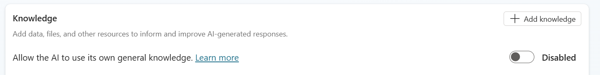

> [!NOTE]
> Les copies d'écran proviennent de la version de novembre 2024. Les libellés d'interface évoluent, notamment celui du choix d'orchestration, qui peut apparaître sous la forme d'une question fermée **Use generative AI orchestration for your agent's responses ? Yes / No**. La logique reste identique.

### Documents de connaissances

Les documents utilisés par le lab sont attendus dans [`Docs`](Docs/).

| Document | Fichier attendu | Utilisation |
|---|---|---|
| [Azure , Compliance Offerings](https://servicetrust.microsoft.com/DocumentPage/7adf2d9e-d7b5-4e71-bad8-713e6a183cf3) | `azure-compliance-offerings.pdf` | Téléversé comme source de type **Files** dans le cas d'usage nº 1 |

### Sources internes préparées par l'animateur

| Ressource | Valeur attendue | Utilisée dans |
|---|---|---|
| Site SharePoint de l'atelier | `https://pplatform.sharepoint.com/sites/KnowledgeBase` ou l'URL communiquée en séance | Cas d'usage nº 2 |
| Connexion connecteur Graph | Connexion **ServiceNowKB3** précréée | Cas d'usage nº 2 |
| Tables Dataverse | **Account** et **Contact**, alimentées avec des données de démonstration | Cas d'usage nº 2 |

> [!TIP]
> Si votre environnement ne dispose ni du site SharePoint, ni de la connexion ServiceNow, le cas d'usage nº 2 reste faisable en ne traitant que la partie Dataverse. Les enseignements sur l'authentification sont les mêmes.

---

<a id="recapitulatif-des-objectifs"></a>
## 🎯 Récapitulatif des objectifs

Ce lab vous fait parcourir toute la chaîne, de l'ajout d'une source à la maîtrise du ton de la réponse. À la fin, vous aurez :

- Ajouté et nommé des sources de connaissances de cinq natures différentes.
- Comparé le rendu des citations selon le type de source.
- Vérifié que le contexte de conversation est préservé d'une question à la suivante.
- Enrichi une source Dataverse avec des synonymes et un glossaire.
- Écrit des instructions personnalisées dans les deux modes d'orchestration.
- Activé les connaissances générales de l'IA et observé la bascule de comportement.
- Restreint les sources interrogées par un nœud de réponses génératives.

---

<a id="cas-d-usage-abordes"></a>
## 🧩 Cas d'usage abordés

| Étape | Cas d'usage | Valeur ajoutée | Effort |
|------|----------|-------------|--------|
| 1 | [Sources publiques, sites web et fichiers](#cas-1-sources-publiques) | Rendre l'agent utile en quelques minutes, sans écrire un seul sujet | 15 min |
| 2 | [Sources internes, Dataverse, SharePoint et connecteur Graph](#cas-2-sources-internes) | Interroger les données de l'entreprise en respectant les droits de chacun | 20 min |
| 3 | [Instructions personnalisées](#cas-3-instructions-personnalisees) | Imposer un ton, un format et un périmètre aux réponses | 15 min |
| 4 | [Connaissances générales et pilotage du nœud](#cas-4-connaissances-generales) | Arbitrer entre couverture et fiabilité, source par source | 10 min |

---

<a id="instructions-par-cas-d-usage"></a>
## 🛠️ Instructions par cas d'usage

---

<a id="cas-1-sources-publiques"></a>
## 🧱 Cas d'usage nº 1 : sources publiques, sites web et fichiers

> [!IMPORTANT]
> **Vérifiez les [prérequis](#prerequis) avant de commencer.** Si les connaissances générales de l'IA restent activées, l'agent répondra de mémoire et vous ne pourrez pas distinguer une réponse ancrée d'une réponse inventée.

Vous endossez le rôle du créateur de l'agent Contoso. Première demande du métier : que l'agent sache répondre aux questions sur Microsoft Copilot Studio et sur les offres de conformité Azure, sans qu'on ait à rédiger la moindre réponse à la main.

| Cas d'usage | Valeur ajoutée | Effort estimé |
|----------|-------------|------------------|
| Sources publiques, sites web et fichiers | Un agent utile en quelques minutes, avec des réponses traçables | 15 minutes |

### Objectif

Ajouter deux natures de sources publiques, un site web et un fichier, puis observer comment les réponses génératives citent chacune d'elles.

---

### Instructions pas à pas

#### Configurer les sources de type site web

1. Ouvrez votre agent et allez dans l'onglet **Knowledge**.

    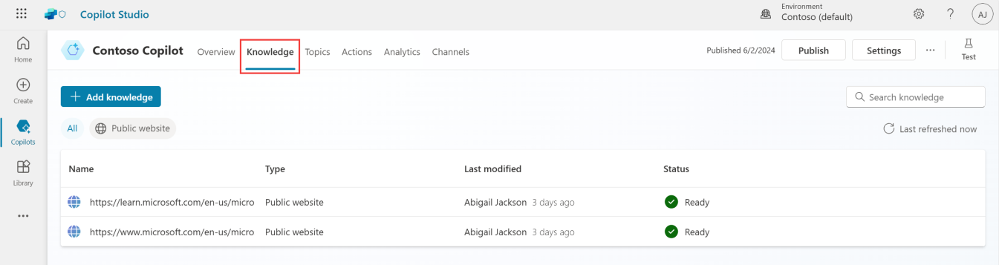

    > [!NOTE]
    > Si vous avez suivi les labs précédents, des sources peuvent déjà être présentes. Sinon, ajoutez les deux sites listés à l'étape suivante.

1. Sélectionnez **Add knowledge**, puis **Public websites**, et ajoutez les adresses suivantes :

    ```text
    https://learn.microsoft.com/en-us/microsoft-copilot-studio/
    ```

    ```text
    https://www.microsoft.com/en-us/microsoft-copilot/
    ```

    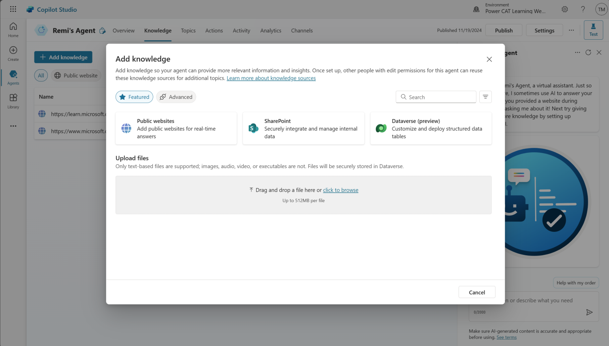

1. Ajoutez un troisième site, dédié à l'adoption :

    ```text
    https://adoption.microsoft.com/en-us/
    ```

1. Donnez à **chaque** source un nom explicite et une description précise de ce qu'elle permet de retrouver.

    > [!IMPORTANT]
    > La description n'est pas un commentaire décoratif. Quand l'orchestration générative est activée, le modèle choisit la source à interroger en lisant ces descriptions. « Documentation produit Copilot Studio : fonctionnalités, licences, limites » oriente correctement ; « site Microsoft » n'oriente rien.

#### Tester les sources de type site web

1. Ouvrez le volet **Test**.

1. Posez une question qui ne correspond à aucun sujet existant, pour déclencher le sujet **Conversational boosting** :

    ```text
    What is Microsoft Copilot Studio?
    ```

    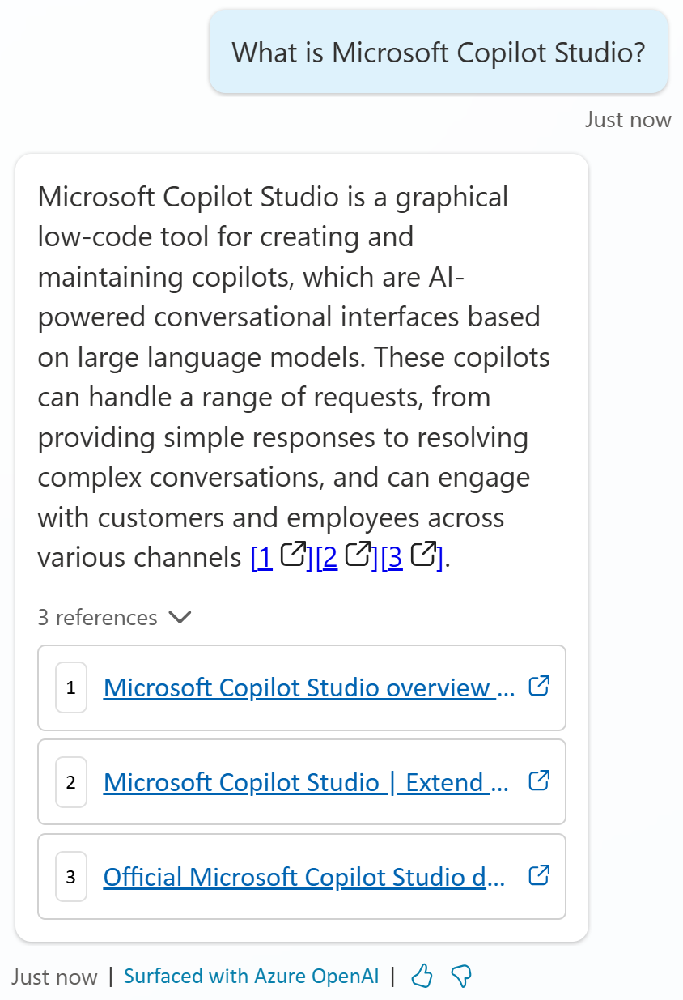

1. Dépliez les références. Vérifiez que la réponse s'appuie bien sur les sites que vous venez d'ajouter, et non sur une connaissance générale.

1. Enchaînez avec une question de suivi, sans répéter le nom du produit :

    ```text
    What knowledge sources does it support?
    ```

    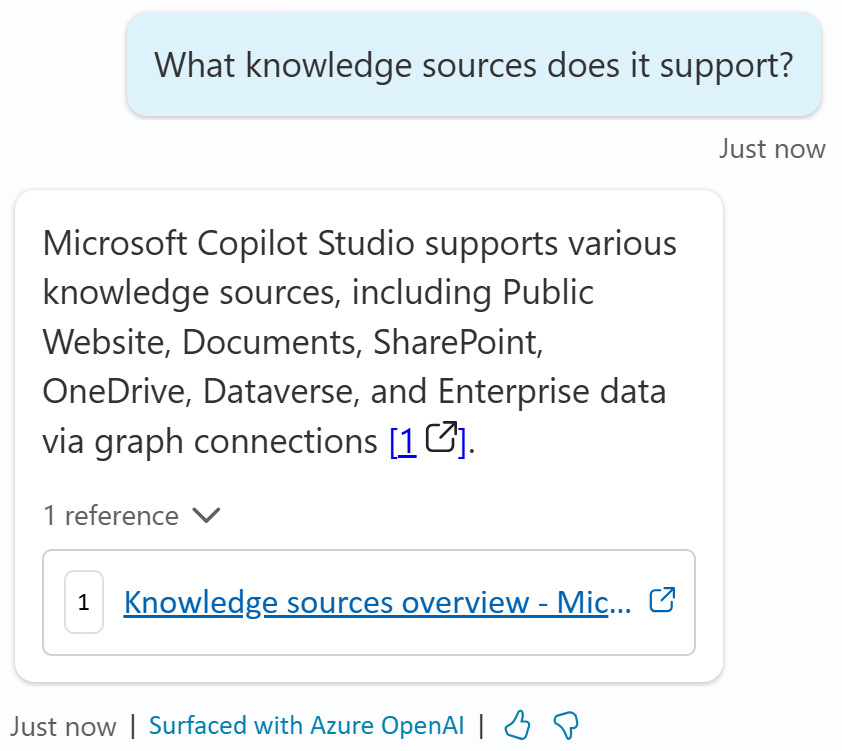

    > [!NOTE]
    > La question de suivi ne nomme pas le produit, et pourtant la réponse reste dans le bon contexte : les réponses génératives conservent l'historique de la conversation pour réinterpréter la question.

#### Ajouter un fichier comme source

1. Téléchargez le document [Azure , Compliance Offerings](https://servicetrust.microsoft.com/DocumentPage/7adf2d9e-d7b5-4e71-bad8-713e6a183cf3) et rangez-le dans le répertoire [`Docs`](Docs/) du lab.

1. Dans l'onglet **Knowledge**, sélectionnez **Add knowledge**, puis **Files**, téléversez le document et cliquez sur **Add**.

1. Revenez sur l'onglet **Knowledge** et attendez que le statut du fichier passe à **Ready**. Utilisez le bouton de rafraîchissement pour suivre l'indexation.

    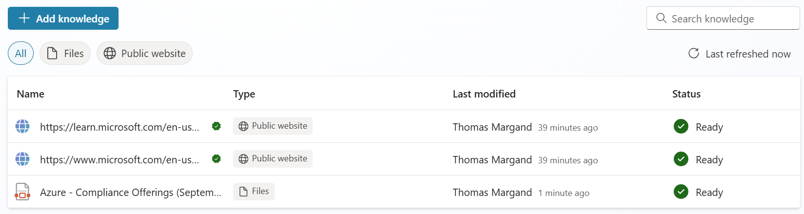

    > [!TIP]
    > L'indexation prend quelques minutes. Profitez-en pour lire le cas d'usage suivant plutôt que d'attendre devant l'écran.

1. Vérifiez une dernière fois que l'option **Allow the AI to use its own general knowledge** est bien désactivée.

1. Dans le volet **Test**, posez la question suivante :

    ```text
    What are Microsoft distinct Azure cloud environments?
    ```

    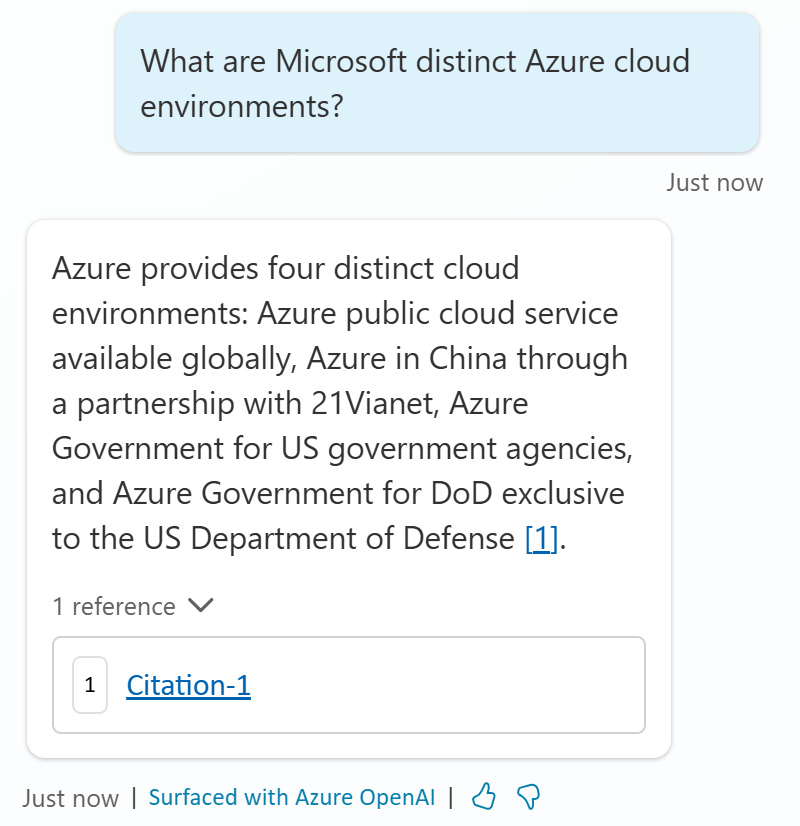

1. Observez la citation : elle ne pointe plus vers une URL publique mais vers un extrait du document téléversé. Le rendu diffère selon le type de source.

### 🏅 Félicitations ! Vous avez terminé le cas d'usage nº 1 !

---

### Testez votre compréhension

* Pourquoi le lab impose-t-il de désactiver les connaissances générales de l'IA avant de tester une source ?
* Qu'est-ce qui, dans la réponse à la question de suivi, prouve que le contexte de conversation a été conservé ?
* Si deux de vos trois sites web pouvaient répondre à la même question, qu'est-ce qui déterminerait celui qui est interrogé ?

---

<a id="cas-2-sources-internes"></a>
## 🧱 Cas d'usage nº 2 : sources internes, Dataverse, SharePoint et connecteur Graph

> [!IMPORTANT]
> Les trois sources de ce cas d'usage exigent une authentification de l'utilisateur final. Dans **Settings → Security → Authentication**, choisissez **Authenticate with Microsoft**, puis **Save**, avant d'aller plus loin.

Le métier revient avec des questions auxquelles aucun site public ne peut répondre : qui sont nos clients à Redmond, que couvre notre mutuelle, comment configure-t-on le VPN. Ces réponses existent, mais dans Dataverse, dans SharePoint et dans ServiceNow.

| Cas d'usage | Valeur ajoutée | Effort estimé |
|----------|-------------|------------------|
| Sources internes | Des réponses sur les données de l'entreprise, filtrées par les droits de l'utilisateur | 20 minutes |

### Objectif

Brancher trois sources internes de natures différentes, enrichir la source Dataverse avec du vocabulaire métier, et constater que la recherche s'effectue dans le contexte de l'utilisateur connecté.

---

### Instructions pas à pas

#### Configurer la source Dataverse

1. Dans l'onglet **Knowledge**, sélectionnez **Add knowledge**, puis **Dataverse**.

1. Sélectionnez les tables **Account** et **Contact**, puis **Next**.

1. Vérifiez que les tables contiennent des données, puis **Next**.

1. Dans **Synonyms**, sélectionnez **Edit**. Pour la colonne **Address 1**, ajoutez le synonyme :

    ```text
    Address
    ```

    et la description :

    ```text
    Complete address of the account
    ```

    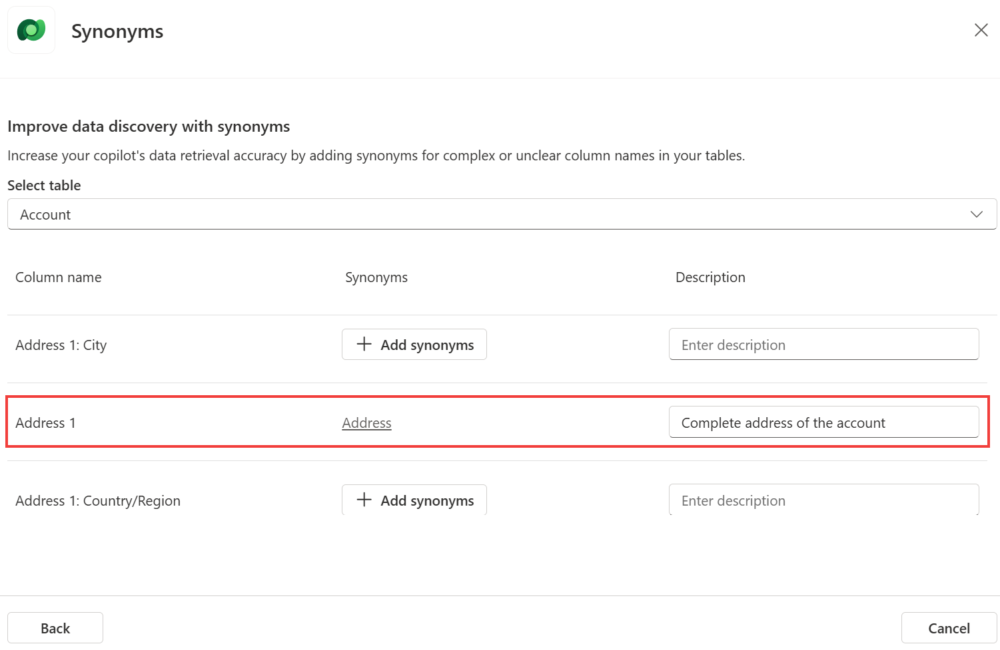

1. Toujours dans **Synonyms**, pour la colonne **Primary Contact**, ajoutez les synonymes :

    ```text
    Main contact
    ```

    ```text
    Contact
    ```

    avec la description :

    ```text
    Primary point of contact person for a given account
    ```

1. Sélectionnez **Back**.

1. Dans **Glossary**, sélectionnez **Edit** et ajoutez le terme :

    ```text
    Customer
    ```

    avec la description :

    ```text
    Customer is a synonym for account
    ```

    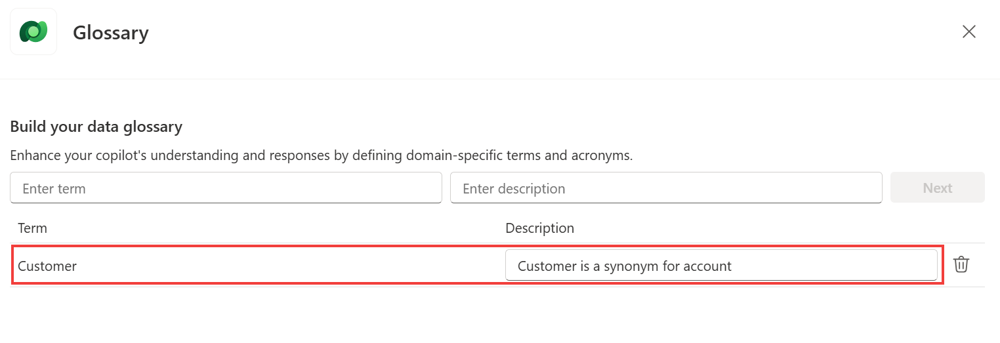

    > [!NOTE]
    > Synonymes et glossaire servent à réconcilier le vocabulaire des utilisateurs avec les noms techniques des colonnes. Les utilisateurs disent « client » et « adresse » ; la base dit `Account` et `Address 1`.

1. Sélectionnez **Next**, puis **Back**. Conservez les valeurs par défaut de **Knowledge name** et **Knowledge description**, puis cliquez sur **Add**.

#### Tester la source Dataverse

1. Ouvrez le volet **Test** et posez les deux questions suivantes, l'une après l'autre :

    ```text
    What customers are located in Redmond? I need their name and address
    ```

    ```text
    Thanks. Who's our main contact at city power and light?
    ```

    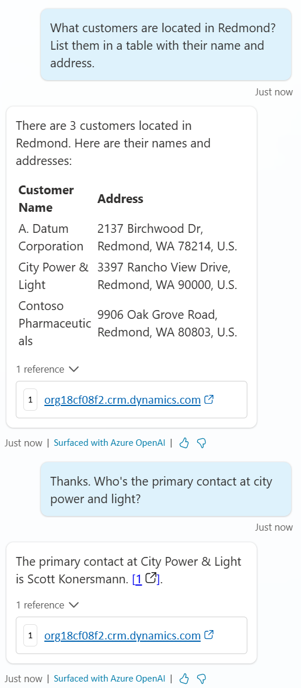

    > [!IMPORTANT]
    > Cette source interroge Dataverse dans le contexte de l'utilisateur connecté. Seuls les enregistrements sur lesquels il possède au moins un droit de lecture sont renvoyés et résumés. Deux utilisateurs différents peuvent donc obtenir deux réponses différentes à la même question : c'est le comportement attendu, pas un défaut.

#### Configurer et tester la source SharePoint

1. Dans l'onglet **Knowledge**, sélectionnez **Add knowledge**, puis **SharePoint**, et saisissez l'URL du site fourni en séance :

    ```text
    https://pplatform.sharepoint.com/sites/KnowledgeBase
    ```

1. Donnez-lui une description explicite :

    ```text
    Answer question about HR, health plan and benefits
    ```

1. Dans le volet **Test**, posez la question suivante :

    ```text
    What is the Northwind Standard plan?
    ```

    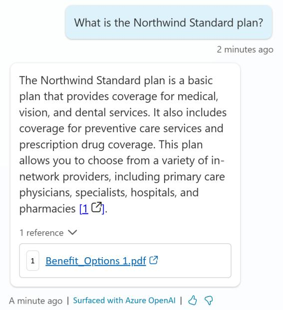

1. Dépliez la référence : elle pointe vers le document SharePoint utilisé, que l'utilisateur peut ouvrir s'il y a accès.

#### Configurer et tester un connecteur Graph

1. Dans l'onglet **Knowledge**, sélectionnez **Add knowledge**, puis l'onglet **Advanced**.

1. Sélectionnez **ServiceNow Knowledge**.

1. Sous **Select an existing connection**, choisissez la connexion précréée **ServiceNowKB3**.

1. Dans le volet **Test**, posez la question suivante :

    ```text
    How do I configure the VPN on my iPhone?
    ```

    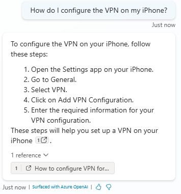

    > [!TIP]
    > Les connecteurs Graph exposent à l'agent des systèmes tiers déjà indexés pour Microsoft Search. C'est la voie à privilégier quand la donnée vit hors de l'écosystème Microsoft 365.

### 🏅 Félicitations ! Vous avez terminé le cas d'usage nº 2 !

---

### Testez votre compréhension

* Pourquoi ces trois sources exigent-elles une authentification alors qu'un site public n'en demande aucune ?
* Que se passerait-il si un utilisateur sans droit sur la table **Account** posait la question sur les clients de Redmond ?
* En quoi les synonymes et le glossaire changent-ils la réponse, alors que les données de la table sont inchangées ?

---

<a id="cas-3-instructions-personnalisees"></a>
## 🧱 Cas d'usage nº 3 : instructions personnalisées

Les réponses sont exactes, mais ternes et trop longues. Le métier veut un ton reconnaissable et des réponses courtes. Vous allez l'obtenir sans toucher aux sources, uniquement par des instructions.

| Cas d'usage | Valeur ajoutée | Effort estimé |
|----------|-------------|------------------|
| Instructions personnalisées | Un ton, un format et un périmètre imposés aux réponses | 15 minutes |

### Objectif

Écrire des instructions personnalisées aux deux endroits possibles, au niveau de l'agent en orchestration générative et au niveau du nœud en orchestration classique, puis vérifier leur effet dans le volet de test.

> [!NOTE]
> Bonnes pratiques d'écriture, à garder sous les yeux pendant tout le cas d'usage :
>
> **Soyez précis.** Une instruction ambiguë produit une réponse ambiguë.
>
> **Donnez des exemples.** Ils valent mieux qu'une longue explication.
>
> **Restez simple.** Une instruction surchargée de conditions est mal appliquée.
>
> **Prévoyez une porte de sortie.** Par exemple : répondre « not found » quand la réponse est absente des sources. C'est ce qui évite les réponses inventées.
>
> **Testez et affinez.** Une instruction ne se valide qu'à l'usage.

---

### Instructions pas à pas

#### Instructions au niveau de l'agent, orchestration générative

1. Allez dans l'onglet **Settings**, puis dans le menu **Generative AI**.

1. Pour **How should your agent decide how to respond ?**, sélectionnez **Generative (preview)**.

1. Sélectionnez **Save**, puis fermez les paramètres.

1. Allez dans l'onglet **Overview**, zone **Details**, et sélectionnez **Edit**.

1. Remplacez le contenu du champ **Instructions** par :

    ```text
    Talk like a pirate and use pirate expressions.
    Use emojis in your responses.
    Answer in less than 50 words.
    ```

    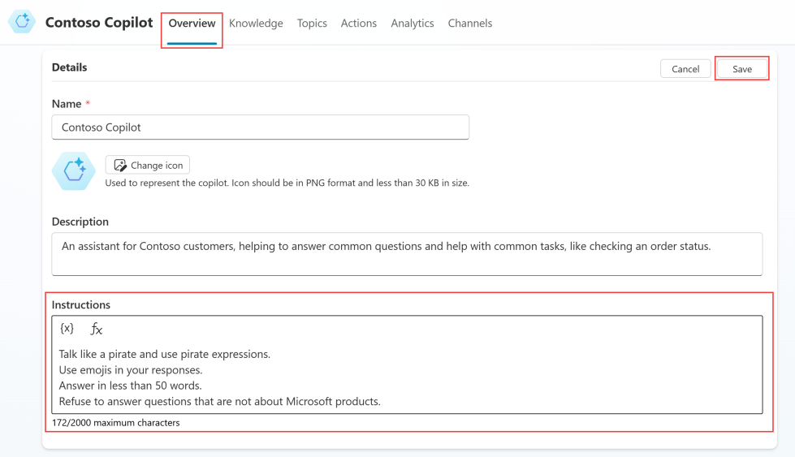

    > [!TIP]
    > Le champ accepte des variables liées au contexte de l'utilisateur. Une instruction du type « Refuse to answer questions that are not about Microsoft products » ajoute un garde-fou de périmètre, en complément du ton.

1. Sélectionnez **Save**.

#### Instructions au niveau du nœud, orchestration classique, optionnel

1. Retournez dans **Settings → Generative AI** et sélectionnez **Classic** pour **How should your agent decide how to respond ?**, puis **Save** et fermez.

1. Allez dans l'onglet **Topics**, zone **System**, et ouvrez le sujet **Conversational boosting**.

1. Ouvrez les propriétés du nœud **Create generative answers**.

1. Dans le champ **Customize your prompt with variables and plain language**, saisissez les mêmes instructions :

    ```text
    Talk like a pirate and use pirate expressions.
    Use emojis in your responses.
    Answer in less than 50 words.
    ```

    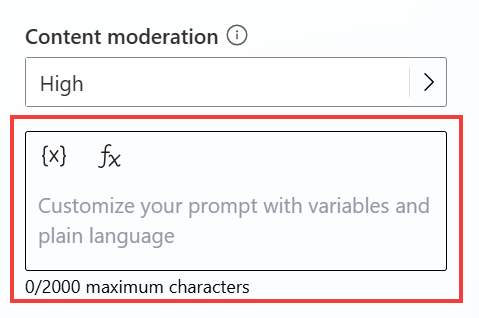

    > [!IMPORTANT]
    > C'est la différence structurante entre les deux modes. En orchestration générative, les instructions valent pour tout l'agent. En orchestration classique, elles valent pour un nœud donné, ce qui permet des comportements différents selon le sujet, mais oblige à les répéter dans chaque nœud de réponses génératives.

1. Sélectionnez **Save**.

#### Tester les instructions

1. Ouvrez le volet **Test**.

1. Reposez la question du premier cas d'usage :

    ```text
    What is Microsoft Copilot Studio?
    ```

    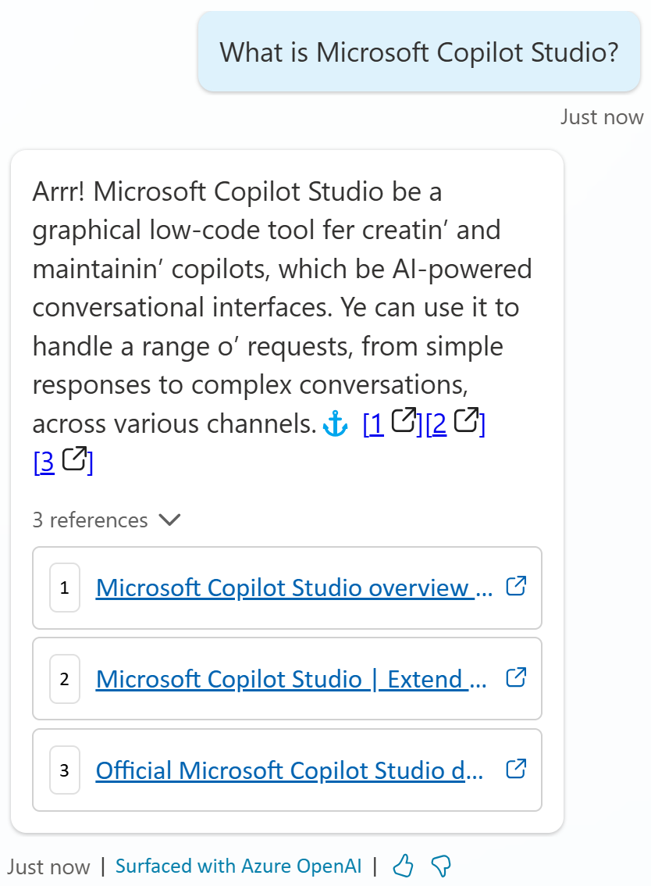

1. Comparez avec la réponse obtenue au cas d'usage nº 1 : le fond est identique, la forme a changé, et les citations sont toujours là.

### 🏅 Félicitations ! Vous avez terminé le cas d'usage nº 3 !

---

### Testez votre compréhension

* Dans quel mode d'orchestration une instruction de ton s'applique-t-elle à l'ensemble de l'agent, et pourquoi ?
* Pourquoi conseille-t-on de prévoir une porte de sortie explicite dans les instructions ?
* Quel risque courez-vous si vous écrivez des instructions différentes dans plusieurs nœuds de réponses génératives d'un même agent ?

---

<a id="cas-4-connaissances-generales"></a>
## 🧱 Cas d'usage nº 4 : connaissances générales et pilotage du nœud

Un utilisateur pose une question qui ne relève d'aucune de vos sources. Faut-il que l'agent réponde quand même ? La réponse dépend du contexte, et c'est vous qui tranchez, réglage par réglage.

| Cas d'usage | Valeur ajoutée | Effort estimé |
|----------|-------------|------------------|
| Connaissances générales et pilotage du nœud | Arbitrer entre couverture et fiabilité, source par source | 10 minutes |

### Objectif

Activer les connaissances générales de l'IA, mesurer le changement de comportement, puis restreindre les sources interrogées par le nœud de réponses génératives.

---

### Instructions pas à pas

#### Activer les connaissances générales de l'IA

1. Allez dans l'onglet **Overview**.

1. Dans la zone **Knowledge**, activez **Allow the AI to use its own general knowledge**.

1. Ouvrez le volet **Test** et posez une question qui ne correspond ni à un sujet, ni à une source configurée :

    ```text
    Can you list the planets from closest to farthest from the sun?
    ```

    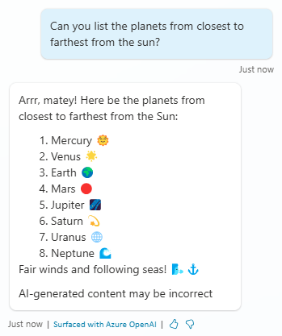

    > [!WARNING]
    > L'agent répond désormais hors de toute donnée d'ancrage, comme le ferait un assistant grand public. Aucune citation ne peut accompagner ce type de réponse. Sur un agent de production, cette bascule doit être une décision assumée, pas un réglage par défaut.

#### Ouvrir le sujet Conversational boosting

1. Allez dans l'onglet **Topics**.

1. Sélectionnez la zone **System**.

1. Ouvrez le sujet **Conversational boosting**.

    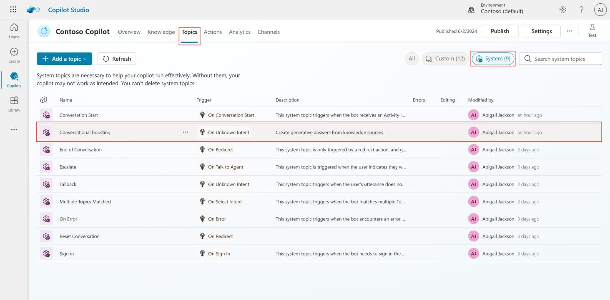

    > [!NOTE]
    > Avec le modèle de compréhension du langage intégré, toute phrase qui ne déclenche aucun sujet arrive ici, puis part vers le sujet **Fallback** si aucune réponse n'est trouvée. Ce sujet se modifie comme n'importe quel autre.

#### Restreindre les sources interrogées par le nœud

1. Ouvrez les propriétés du nœud **Create generative answers**.

1. Activez **Search only selected sources** et observez la liste : vous choisissez à la main les sources interrogées à cet endroit précis du parcours.

1. Sélectionnez toutes les sources **sauf** la source SharePoint, la plus lente à répondre.

    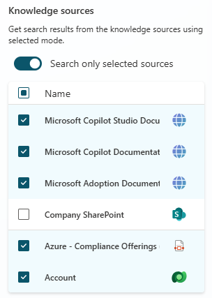

1. Dans le même volet, repérez les autres réglages disponibles : désactivation des connaissances générales pour ce nœud uniquement, instructions personnalisées supplémentaires, et **Content moderation**.

    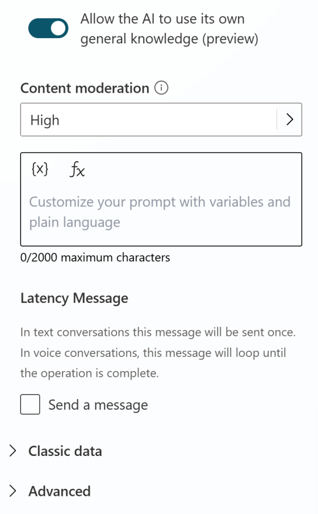

    > [!IMPORTANT]
    > **Content moderation** règle le niveau de contrôle appliqué pour éviter que l'agent ne se trompe en surinterprétant les données d'ancrage. Un niveau élevé écarte davantage de réponses douteuses, au prix de quelques réponses légitimes perdues.

1. Sélectionnez **Save**.

    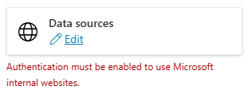

    > [!TIP]
    > L'avertissement d'authentification affiché sous **Data sources** ne s'applique pas aux tests réalisés dans ce lab. Vous pouvez l'ignorer ici, mais pas sur un agent destiné à la production.

### 🏅 Félicitations ! Vous avez terminé le cas d'usage nº 4 !

---

### Testez votre compréhension

* Dans quels cas accepteriez-vous d'activer les connaissances générales sur un agent destiné à des clients externes ?
* Pourquoi le réglage des sources interrogées existe-t-il au niveau du nœud, alors que les sources sont déjà déclarées au niveau de l'agent ?
* Quel indice, dans une réponse, permet de savoir qu'elle ne provient d'aucune de vos sources ?

---

<a id="synthese-des-apprentissages"></a>
## 🏆 Synthèse des apprentissages

Les quatre cas d'usage racontent la même histoire vue sous quatre angles : un agent ne devient fiable que lorsque vous savez d'où vient chacune de ses phrases.

* **La citation est l'unité de confiance.** Une réponse sans citation n'est pas une réponse ancrée. C'est le premier réflexe de diagnostic quand un agent répond de travers.
* **La description d'une source fait partie de la configuration.** En orchestration générative, c'est elle, et non le contenu, qui décide si la source est interrogée.
* **Les sources internes héritent des droits de l'utilisateur.** Ce qui remonte dépend de qui pose la question, ce qui rend les tests plus délicats et la sécurité plus simple.
* **Le vocabulaire se configure.** Synonymes et glossaire font le pont entre les mots des utilisateurs et les noms des colonnes, sans toucher aux données.
* **L'endroit des instructions dépend du mode d'orchestration.** Agent en générative, nœud en classique. Chercher au mauvais endroit fait perdre un temps considérable.
* **Les connaissances générales sont un arbitrage, pas un interrupteur anodin.** Elles élargissent la couverture et suppriment la traçabilité.

---

<a id="conclusions-et-recommandations"></a>
## 🔍 Conclusions et recommandations

**Pour construire un agent de production à partir de ce que vous venez de voir :**

* **Nommez et décrivez chaque source comme si quelqu'un d'autre devait la maintenir.** C'est aussi ce que lit le modèle pour choisir sa source.
* **Commencez sources générales désactivées.** Activez-les seulement après avoir constaté un manque réel de couverture, et prévenez les utilisateurs que certaines réponses ne sont pas ancrées.
* **Testez avec plusieurs comptes.** Un agent branché sur Dataverse ou SharePoint ne se valide pas depuis un seul compte administrateur, sous peine de découvrir les problèmes de droits en production.
* **Écrivez toujours une porte de sortie dans vos instructions.** « Répondre "not found" si l'information est absente des sources » vaut mieux qu'une réponse inventée avec assurance.
* **Restreignez les sources dans les nœuds sensibles.** Une source lente ou hors sujet dégrade la réponse même quand elle ne sert à rien : le réglage **Search only selected sources** est un outil de performance autant que de pertinence.

---
